# **一、数据库基础**

1963年美国Honeywell公司的IDS（Integrated Data Store）系统投入运行，揭开了数据库技术的序幕。20世纪70年代是数据库蓬勃发展的年代。20世纪80年代关系数据库系统由于使用简便以及硬件性能的改善，逐步代替网状数据库系统和层次数据库系统占领了市场。20世纪90年代关系数据库已成为数据库技术的主流。进入21世纪以后无论是市场需求还是技术条件，数据库技术已经大面积的的推广和应用。

## **1、关系**

关系是数学上的一个概念，建立在日常生活的关系概念之上，例如通常所说的邻里关系、朋友关系、学生与所选修的课程及该课程的成绩关系等。在这里朋友关系涉及到了互为朋友的双方，在数学上可表示为（张, 李）；邻里关系也涉及到了互为邻里的双方，表示为（李家, 张家）；学生与所选修的课程及该课程的成绩关系，涉及到学生、所选的课程以及所取得的成绩，在数学上表示为（李兰, 软件基础, 90）。（李, 张）、（李家, 张家）、（李兰, 软件基础, 90）在数学上称为元组，括号里用逗号隔开的对象，数学上称为元组的属性。

 

数据库技术中关系概念是：关系是同类型元组的结合。简单地说，关系是元组的集合，通常使用大写字母R表示。

例如，学生与所选课程及该课程的成绩之间的关系R可以表示为：

R={

​	(李兰, 软件基础, 90),

​	(张娜, 高等数学, 87),

​	(张伟, C语言, 76),

​	…

​	(韶华, 英语, 79)

}

 

这样的一个关系R，在日常生活中可通常表示成一个表格的形式：

| ***\*姓名\**** | ***\*课程名\**** | ***\*成绩\**** |
| -------------- | ---------------- | -------------- |
| 李兰           | 软件基础         | 90             |
| 张娜           | 高等数学         | 87             |
| 张伟           | C语言            | 76             |
| …              | …                | …              |
| 韶华           | 英语             | 79             |

 

可以看到，这张表表示一个关系，表中的每一行表示一个元组，每一列的数据表示元组的属性值。

## **2、关系数据库**

关系数据库就是描述关系数据的系统。

### **（1）存储方案**

淘宝、京东等系统都有各自的功能，当我们关闭系统后，下次再访问这些网站时，为什么我们的订单信息等还存在？因为我们提供了持久存储解决方案，通常有两种方案供选择：文件、数据库。

#### **A、文件**

我们之前学习过文件，大家可能回答用文件就可以保存数据嘛！没错，我们确实可以使用文件来保存各类数据，但是这种方式存在几个缺点:

1、文件的安全性问题。

2、文件不利于查询和对数据的管理。

3、文件不利于存放海量数据。

4、文件在程序中控制不方便。

#### **B、数据库**

为了解决上述问题提供了数据库技术，它能更有效的管理数据，并且解决了文件存储数据时的各种问题。

### **（2）什么是关系数据库**

数据库（Database）是按照一定的数据结构来组织、存储和管理数据的仓库，每个数据库都有一个或多个不同的API用于创建、访问、管理、搜索和复制所保存的数据。

关系数据库管理系统的全称是Relational Database Management System，简称RDBMS，是建立在关系模型基础上的数据库，借助于集合等数学概念和方法来处理数据。

 

通常使用关系型数据库管理系统来存储和管理大量数据，主要有以下特点：

1、每行为一条记录数据。

2、每列为记录数据所对应的数据域。

3、同类型的的行组成一张二维数据表。

4、若干的二维数据表组成关系数据库。

### **（3）关系数据库的实例**

通常关系数据库包含若干个数据表。每个数据表中都有多个行（记录，相当于对象），每个记录有多个列（字段，相当于对象的属性）。表之间可以通过主外键字段实现表之间的关系，通过关系可以更灵活地表示和操纵数据库中的数据。

 

例如：

"班级"和"学生"是两张数据表，每个表中有多行记录，每行记录有多个列。

"班级"中使用"班号"作为主键。

"学生"中使用"学号"作为主键，"班号"作为外键，"班号"的值是参考"班级"中"班号"的值。

班级和学生之间是一对多关系，即一个班级可以有多个学生，但是一个学生只能属于一个班级。

 

***\*班级(班号, 班级名称)\****		***\*"班号"是主键\****

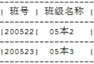 

 

***\*学生(学号, 姓名, 性别, 出生日期, 籍贯, 班号)\****		***\*"学号"是主键，"班号"是外键\****

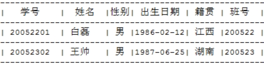 

### **（4）关系数据库的术语**

以上面的"班级"和"学生"数据表为例。

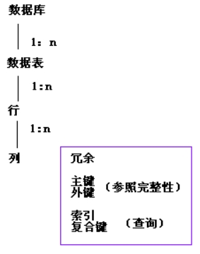 

#### **A、*****\*数据库\****

数据库是一些关联表的集合。例如有一个学生数据库，在数据库中包括"班级"、"学生"等数据表，其中"班级"和"学生"之间是一对多关系。

#### **B、*****\*数据表、行、列、冗余\****

***\*1、数据表\****

每个数据表实际上就是一个关系。例如学生(学号, 姓名, 性别, 出生日期, 籍贯, 班级)，其中"学号"是主键，"班号"是外键。

 

***\*2、行\****

一行（元组，或记录）是一组相关的数据。例如，学生表中一条学生的数据：

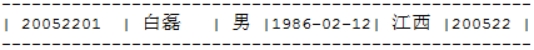 

 

***\*3、列\****

列包含了相同数据类型的元素。例如学生表中学号、姓名都是字符数据，出生日期是日期数据。

 

***\*4、冗余\****

冗余是指在数据库中存储两个及以上的相同数据。冗余可以使系统速度更快，但是需要保证两处数据的一致性，因此数据管理和维护更加复杂。

例如，在学生表中冗余"班级名称"，设计如下：

学生(学号,姓名,性别,出生日期,籍贯,班号,班级名称)  "学号"是主键，"班号"是外键

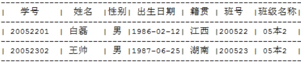 

在数据库设计中一般不要出现冗余字段，我们需要编程来维护多张表中冗余字段的数据一致性。例如，这里需要让"学生"和"班级"表中"班级名称"保持一致。实际应用中，消除冗余字段后，应该通过学生的"班号"在班级表中查找相应的"班级名称"，这是数据库中最常用的获取关联数据的方法。

#### **C、*****\*主键、外键和参照完整性\****

***\*主键\****：一个数据表中只能包含一个主键。主键的值是唯一的，不允许重复。使用主键可以唯一的确定一行。

***\*外键\****：外键用于关联两个表。外键有参照完整性的约束要求。

***\*参照完整性\****：参照完整性要求关系中不允许引用不存在的实体，而实体完整性是关系模型必须满足的完整性约束条件，这样做的目的是保证数据的一致性。

 

学生(学号, 姓名, 性别, 出生日期, 籍贯, 班号)  "学号"是主键，"班号"是外键

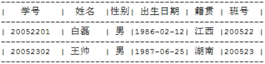 

"学号"是主键，因此每行数据中"学号"的值都是不允许重复的，也不允许为空。

"班号"是外键，它是用于关联到"班级表"，这样在"学生表"中，通过"班号"就可以查询到"班级表"中对应的记录。

由于"学生表"中"班号"的值，必须是"班级表"中"班号"列中的某个值，即对"学生表"中"班号"的值是有约束的，这就是参照完整性。

#### **D、*****\*索引和复合键\****

在关系数据库中，索引是一种单独的、物理的数对数据库表中一列或多列的值进行排序的一种存储结构，它是某个表中一列或若干列值的集合和相应的指向表中物理标识这些值的数据页的逻辑指针清单。索引的作用相当于图书的目录，可以根据目录中的页码快速找到所需的内容。

索引提供指向存储在表的指定列中的数据值的指针，然后根据您指定的排序顺序对这些指针排序。数据库使用索引以找到特定值，然后顺指针找到包含该值的行。这样可以使对应于表的SQL语句执行得更快，可快速访问数据库表中的特定信息。

当表中有大量记录时，若要对表进行查询，第一种搜索信息方式是全表搜索，是将所有记录一一取出，和查询条件进行一一对比，然后返回满足条件的记录，这样做会消耗大量数据库系统时间，并造成大量磁盘I/O操作；第二种就是在表中建立索引，然后在索引中找到符合查询条件的索引值，最后通过保存在索引中的ROWID（相当于页码）快速找到表中对应的记录。

 

每个数据表中都有一个主键，数据库系统默认会使用所有主键值创建一个索引。因此，使用主键查找数据是一种最常用的查询方法。

复合键也称为"组合键"，通常是根据业务的查询要求，将一些关联列组合在一起，从而提高查询效率。一般用于复合索引。

### **（5）常用关系数据库**

| Oracle     | 目前最成功的关系型数据库管理系统。运行稳定、功能齐全、性能超群、技术领先。主要应用在大型的企业数据库领域。 |
| ---------- | ------------------------------------------------------------ |
| MySQL      | 免费的数据库系统。被广泛用于中小型应用系统。体积小、速度快、总体拥有成本低，开放源代码。2008年被SUN收购，2009年SUN被Oracle收购。 |
| DB2        | IBM的大型数据库产品。                                        |
| SQL Server | Microsoft的产品。软件界面友好、易学易用，在操作性和交互性方面独树一帜。 |
| PostgreSQL | 加州大学伯克利分校以教学目的开发的数据库系统，支持关系和面向对象的数据库，属于自由数据库管理系统。 |
| MariaDB    | MariaDB数据库管理系统是MySQL的一个分支，主要由开源社区在维护，采用GPL授权许可。MariaDB的目的是完全兼容MySQL，包括API和命令行，使之能轻松成为MySQL的代替品。在存储引擎方面，使用XtraDB（英语：XtraDB）来代替MySQL的InnoDB。 |

 

# **二、MySQL**

## **1、MySQL简介**

MySQL是一个关系型数据库管理系统，由瑞典MySQL AB公司开发，目前属于Oracle旗下产品。MySQL是最流行的关系型数据库管理系统之一，在WEB应用方面，MySQL是最好的关系型数据库管理系统。

MySQL使用的SQL语言是访问数据库的最常用标准化语言。MySQL软件采用了双授权政策，分为社区版和商业版，由于其体积小、速度快、总体拥有成本低，尤其是开放源码这一特点，一般中小型网站的开发都选择MySQL作为网站数据库。

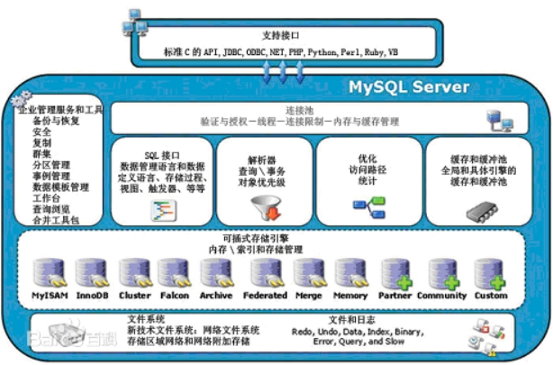 

## **2、MySQL安装与删除**

MySQL最新版本是5.7。

### **（1）MySQL服务器安装**

下载MySQL 5.7的安装程序，运行安装向导，按照向导一步步的安装。

1、在安装向导中选择“Skip the check for updates”，即不需要连网查找最新版本。

2、在安装向导中选择"***\*Server Only\****"，这将只安装MySQL服务器，不会安装客户端和开发工具。

3、其它安装向导界面中都使用默认的设置即可。

4、在安装过程中，向导会提示输入管理员的密码。注意：管理员账号是root，这是默认的。

 

***\*OLAP和OLTP的区别：\****

OLAP是联机分析处理。联机分析通常用于决策支持，在数据库中的主要操作是读取数据，基本不会向数据写数据。它的特点是每次处理时间长且数据量大，基本都是读操作。

OLTP是联机事务处理。这是日常事务的处理，相当于记流水账，例如，每个新员工的入职就是一个事务。它的特点是处理非常频繁，但是每次处理时间短且数据量小，同时CRUD操作都非常多。

### **（2）验证MySQL是否安装成功**

***\*1、MySQL服务管理\****

MySQL安装完成后，会将MySQL设置成操作系统服务。可以在操作系统的“服务”管理工具中进行管理。

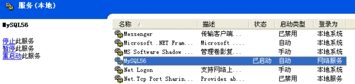 

 

**2、*****\*使用命令行工具进行交互\****

可以将mysql安装目录中的bin目录加到path中，方便运行mysql.exe。

 

| 1    | 登录MySQL  | mysql -uroot -proot       | 假定密码是root       |
| ---- | ---------- | ------------------------- | -------------------- |
| 2    | 查看数据库 | show databases***\*;\**** | 查看默认安装的数据库 |
| 3    | 退出       | exit 或 quit              |                      |

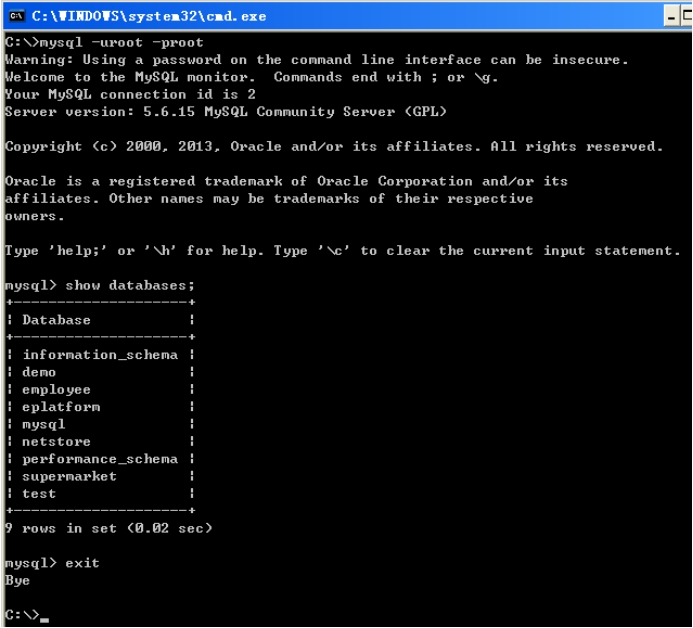 

注意：在MySQL的命令行环境中，所有SQL语句都以 ***\*;\**** 结尾。

### **（3）图形客户端（SQLyog_Enterprise）安装**

有解压缩版本和安装版本。这里使用解压缩版本，直接解压后，运行SQLyogEnt.exe即可。

#### **A、连接界面**

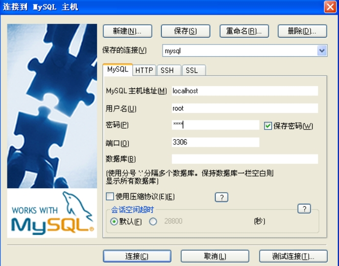 

#### **B、主界面**

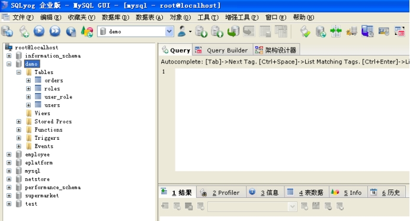 

### **（4）删除MySQL**

MySQL自带的卸载程序并不能完整的卸载所有安装内容，还需要手工删除一些内容，否则无法重新安装MySQL。

 

1、停止MySQL服务。

2、在“添加删除程序”中卸载MySQL。

3、删除MySQL的安装目录及其中所有未被删除的内容。

4、删除MySQL的数据目录和文件。

​	C:\Documents and Settings\{安装用户}\Application Data\MySQL

​	C:\ProgramData\MySQL

5、查看注册表，搜索mysql，找到一律删掉！

​	HKEY_LOCAL_MACHINE\SYSTEM\CurrentControlSet\Services

​	HKEY_LOCAL_MACHINE\SYSTEM\ControlSet001\Services

​	HKEY_LOCAL_MACHINE\SYSTEM\ControlSet002\Services

============================

不需要重启电脑，直接重新安装MySQL即可

## **3、MySQL命令行基础**

MySQL有一个命令行程序mysql.exe，在命令行中直接运行mysql.exe进入交互命令模式。

### **（1）登录到MySQL**

当MySQL服务已经运行时，我们可以通过MySQL自带的命令行工具登录到MySQL数据库中。首先打开命令提示符，输入以下格式的命名：

mysql -h 主机名 -u 用户名 -p

-h：该命令用于指定客户端所要登录的MySQL主机名，登录当前机器该参数可以省略。

-u：所要登录的用户名。

-p：告诉服务器将会使用一个密码来登录，如果所要登录的用户名密码为空，可以忽略此选项。

 

以刚刚安装在本机的MySQL数据库为例，在命令行下输入 mysql -u root -p 按回车确认，如果安装正确且MySQL正在运行，会得到以下响应：

Enter password:

输入正确密码后将成功登录MySQL，命令提示符会一直以 mysql> 加一个闪烁的光标来等待输入命令。

### **（2）修改root密码**

1、停止MySQL服务。

​	在服务中停止MySQL服务。或者在cmd中执行命令net stop mysql

2、在cmd下输入mysqld --skip-grant-tables启动服务器，不要关闭该命令行窗口。

3、打开一个新的命令行界面，输入mysql -u root -p，现在不需要密码就可以访问MySQL。接着输入以下两条命令：

​	use mysql;

​	update user set password=password('abc') WHERE User='root';

​	这里是将密码改为abc，你可以设置自己的密码。

4、关闭两个命令行窗口后，在任务管理器中结束mysqld进程，或者是直接重新系统。

5、在服务中重启MySQL服务。

现在，root密码修改完成。

### **（3）命令行程序的编码集**

#### **A、问题**

我们有时会遇到向数据库中插入中文时出错，或者是select的时候发现中文是乱码。例如，在student表中执行：

​	insert into student(name, age) values('张三',10);

那怎么样才能解决这种问题呢？

#### **B、原因分析**

这是因为命令行客户端和MySQL服务器之间的编码集不相同产生的问题，只要两边的编码集保持一致就没有问题了。

要解决字符集的问题，首先要知道现在的系统、数据库、表、客户端等使用什么样的字符集，以及系统支持什么字符集等。

 

***\*1、查看数据库编码的具体信息\****

​	mysql> show variables like 'character%';

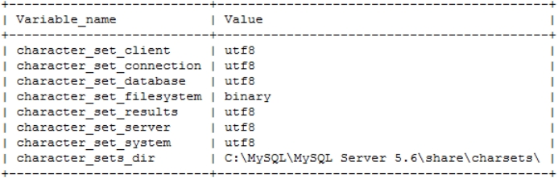 

 

***\*2、数据库的编码参数解释\****

| character_set_client     | 客户端来源数据使用的字符集        |
| ------------------------ | --------------------------------- |
| character_set_connection | 连接层字符集                      |
| character_set_results    | 查询结果字符集                    |
| character_set_server     | MySQL默认的内部操作字符集         |
| character_set_database   | 当前选中数据库的默认字符集        |
| character_set_system     | MySQL系统元数据（字段名等）字符集 |

 

当客户端连接服务器的时候，它会将自己的字符集名称发给mysql服务器，然后服务器使用这个字符集去设置character_set_connection、character_set_client、character_set_results。例如，在中文操作系统中，命令行程序默认使用GBK编码。

#### **C、MySQL中的字符集转换过程** 

1、MySQL收到请求时，将数据从character_set_client转换为character_set_connection。

2、在内部操作之前，将数据从character_set_connection转换为内部操作字符集，其确定方法如下：

​	（1）使用每个数据字段的CHARACTER SET设定值。

​	（2）若上述值不存在，则使用对应数据表的DEFAULT CHARACTER SET设定值（MySQL扩展，非SQL标准）。

​	（3）若上述值不存在，则使用对应数据库的DEFAULT CHARACTER SET设定值。

​	（4）若上述值不存在，则使用character_set_server设定值。

3、将操作结果从内部操作字符集转换为character_set_results。

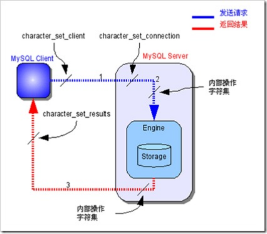 

#### **D、解决问题**

在中文操作系统中，cmd的默认编码为GBK，但MySQL数据库的默认编码为UTF-8，这样导致使用GBK和UTF-8转换中文数据时产生乱码。

 

只需要将命令行程序的编码设置为GBK编码即可。在MySQL的命令行程序中，执行下面的命令：

​	mysql>Set character_set_client=gbk;

​	mysql>Set character_set_results=gbk;

 

也可以在my.ini文件中，设置字符集：

default-character-set=latin1			改为default-character-set=gbk

character-set-server=latin1			改为character-set-server=gbk

## **4、备份与恢复（SQL脚本）**

### **（1）备份数据**

mysqldump命令是直接在命令控制台下执行，不需要事先登录MySQL。

 

mysqldump可以提供多种导出方式：

***\*1、完整备份（导出数据和表结构）\****

mysqldump --no-defaults -uroot -p密码 数据库名 > c:/mydb.sql

 

***\*2、导出表结构不导出数据\****

mysqldump --no-defaults -uroot -p密码 -d 数据库名 > c:\mydb1.sql

 

***\*3、导出数据不导出表结构\****

mysqldump --no-defaults -uroot -p密码 -t 数据库名 > c:\mydb1.sql

### **（2）恢复数据**

由于mysqldump导出的是完整的SQL语句，因此只需要在MySQL中执行导出的SQL脚本就能把数据导入了。

1、登录mysql。

2、创建指定的数据库。例如：CREATE DATABASE mydb1;

3、进入到指定数据库。例如：USE mydb1;

4、执行SQL脚本。例如：mysql> source c:\mydb1.sql;

# **三、SQL（DDL）**

## **1、SQL**

SQL（Structure Query Language）是美国国家标准局（ANSI）从1986年首次推出的一种关系数据库语言，后来被国际化标准组织（ISO）采纳为关系数据库语言的国际标准。

 

数据库管理系统可以通过SQL（结构化查询语言）来定义和操作数据，维护数据的完整性和安全性，以及进行各种数据库的管理等。它所支持的SQL提供以下功能：

| ***\*DDL\*******\*（Data Definition Language）\****   | 数据定义语言。用于创建数据库和表的结构。常用关键字：创建（create）、修改（alter）、删除（drop）。 |
| ----------------------------------------------------- | ------------------------------------------------------------ |
| ***\*DML\*******\*（Data Manipulation Language）\**** | 数据操作语言。用来操作数据库表中的记录（数据）。常用关键字：增加（insert）、删除（delete）、修改（update）。 |
| ***\*DQL\*******\*（Data Query Language）\****        | 数据查询语言。用来查询数据。常用关键字：查询（select）。     |
| ***\*DCL\*******\*（Data Control Language）\****      | 数据控制语言。负责数据完整性、安全性的定义与检查，以及并发控制、故障恢复等。 |

 

## **2、DDL（数据库操作）**

数据定义语言。用于创建数据库和表的结构。

### **（1）创建数据库**

#### **A、语法**

CREATE {DATABASE | SCHEMA} [IF NOT EXISTS] db_name

​	[create_specification [, create_specification] ...]

 

create_specification:

​	[DEFAULT] CHARACTER SET charset_name		// 指定字符集

​	| [DEFAULT] COLLATE collation_name			// 指定字符集的排序方式

 

排序方式的命名规则为：字符集名字_语言_后缀，其中各个典型后缀的含义如下：

1、_ci：不区分大小写的排序方式。

2、_cs：区分大小写的排序方式。

3、_bin：二进制排序方式，大小比较将根据字符编码，不涉及人类语言，因此_bin的排序方式不包含人类语言。

例如，gbk_chinese_ci排序方式就表示：字符集为gbk，人类语言使用中文来比较大小，比较时区分大小写。

#### **B、例子**

1、创建一个名称为mydb1的数据库。

​	CREATE DATABASE mydb1;

 

2、创建一个使用gbk字符集的mydb2数据库。

​	CREATE DATABASE mydb2 CHARACTER SET gbk;

 

3、创建一个使用utf-8字符集，并带校对规则的mydb3数据库。

​	CREATE DATABASE mydb3 CHARACTER SET utf8 COLLATE utf8_general_ci;

​	注：UTF-8字符集使用utf8_general_ci排序规则即可。

### **（2）查看数据库**

#### **A、语法**

查看当前数据库服务器中的所有数据库：

​	SHOW DATABASES

 

查看数据库的定义信息：

​	SHOW CREATE DATABASE db_name

#### **B、例子**

1、查看当前数据库服务器中的所有数据库：

​	SHOW DATABASE;

 

2、查看前面创建的mydb2数据库的定义信息：

​	SHOW CREATE DATABASE mydb2;

### **（3）修改数据库**

#### **A、语法**

ALTER DATABASE [IF NOT EXISTS] db_name??? 

​	[alter_specification [, alter_specification] ...] 

 

alter_specification:

​	[DEFAULT] CHARACTER SET charset_name? 

​	| [DEFAULT] COLLATE collation_name

#### **B、例子**

1、查看服务器中的数据库，并把mydb2的字符集修改为utf8;

​	ALTER DATABASE mydb2 CHARACTER SET utf8;

 

2、查看修改后的信息：

​	SHOW CREATE DATABASE mydb2;

### **（4）删除数据库**

#### **A、语法**

DROP DATABASE [IF EXISTS] db_name

#### **B、例子**

1、删除前面创建的mydb3数据库：

​	DROP DATABASE mydb3;

### **（5）当前数据库**

#### **A、语法**

查看当前使用的数据库：

​	Select database();

 

切换数据库：

​	USE 数据库名;

#### **B、例子**

1、查看当前使用的数据库：

​	Select database();

 

2、切换当前数据库：

​	USE mydb2;

## **3、DDL（数据表操作）**

### **（1）创建表**

#### **A、语法**

CREATE TABLE 表名(

​	字段1 字段类型,

​	字段2 字段类型,

​	...

​	字段n 字段类型

);

#### **B、常用数据类型**

| ***\*名称\**** | ***\*类型\**** | ***\*说明\****                                               |
| -------------- | -------------- | ------------------------------------------------------------ |
| int            | 整数           |                                                              |
| double         | 浮点数         |                                                              |
| decimal        | 定位精度小数   | 例如：decimal(5,2)表示最多5位，其中必须有2位小数，即最大值为999.99。 |
| char           | 固定长度字符串 | 例如：char(10)的数据'aaa    '中只有三个有效字符，但总共占10个字符长，后面七个是空格。一般不用。 |
| varchar        | 可变长度字符串 | 例如：varchar(10)的数据'aaa'中只有3个字符，没有多余的空格。它最多可以有10个字符。这是最常用类型。 |
| date           | 日期           | 格式为：yyyy-MM-dd。只有日期数据。                           |
| time           | 时间           | 格式为：hh:mm:ss。只有时间数据。                             |
| timestamp      | 时间戳         | 格式为：yyyy-MM-dd hh:mm:ss。使用这个类型时，写入记录会自动被赋值为当前时间。一般不用。 |
| datetime       | 日期时间       | 格式为：yyyy-MM-dd hh:mm:ss。表示日期和时间。最常用。        |
| text           | 大字符串       | 保存大数据量的字符，<4M。一般不用。                          |
| blob           | 二进制大对象   | 可以存储二进制文件的容器，如文件、图片。一般不用。           |

 

#### **C、例子**

1、创建一个员工表（employee）：

| ***\*字段\**** | ***\*属性\**** |
| -------------- | -------------- |
| id             | 整型           |
| name           | 字符型         |
| gender         | 字符型         |
| birthday       | 日期型         |
| entrydate      | 日期型         |
| job            | 字符型         |
| salary         | 小数型         |
| resume         | 文本型         |

 

​	CREATE TABLE employee (

​		id int,

​		name varchar(50),

​		gender varchar(10),

​		birthday date,

​		entrydate date,

​		job varchar(100),

​		salary decimal(9,3),

​		resume varchar(200)

​	);

### **（2）查看数据表信息**

#### **A、语法**

当前数据库中的所有表：

​	SHOW TABLES;

 

查看表的字段信息：

​	DESC 数据库表名;

#### **B、例子**

1、当前数据库中的所有表：

​	SHOW TABLES;

 

2、查看表的字段信息：

​	DESC employee;

### **（3）更改表**

#### **A、语法**

使用ALTER TABLE语句追加、修改或删除列。

​	ALTER TABLE table_name

​	ADD		  (column datatype [DEFAULT expr]

​			  [, column datatype]...);

 

​	ALTER TABLE table_name

​	MODIFY	  column datatype [DEFAULT expr]

​			  [, column datatype]...;

 

​	ALTER TABLE table_name

​	DROP	   (column);

 

修改表的名称：

​	RENAME TABLE 表名 TO 新表名

 

修改表的字符集：

​	ALTER TABLE 表名 CHARACTER SET 字符集;

#### **B、例子**

1、在上面员工表的基本上增加一个image列：

​	ALTER TABLE employee ADD image blob;

 

2、修改job列，使其长度为60：

​	ALTER TABLE employee MODIFY job varchar(60);

 

3、删除image列，一次只能删一列：

​	ALTER TABLE employee DROP image;

 

4、表名改为user：

​	RENAME TABLE employee TO user;

 

5、查看表格的创建细节：

​	SHOW CREATE TABLE user;

 

6、修改表的字符集为gbk：

​	ALTER TABLE user CHARACTER SET gbk;

 

7、列名name修改为username：

​	ALTER TABLE user CHANGE COLUMN name username varchar(100);

### **（4）删除表**

#### **A、删除表**

DROP TABLE 表名;

#### **B、例子**

1、删除前面改名为user的表：

​	DROP TABLE user;

## **4、数据的完整性**

在创建表时给表中添加约束来确保数据的完整性。完整性约束有三类：实体完整性、域完整性、引用完整性。

### **（1）实体完整性**

表中的一行代表一个实体（entity）记录，实体完整性的作用是保证同一表中每一行数据都不会重复。实体完整性的约束类型：主键约束（primary key）、唯一约束（unique）、自动增长列（auto_increment）。

#### **A、主键约束（primary key）**

每个表中都必须有一个主键。主键约束的特点：主键列的数据是唯一的，不允许重复，且不能为null。

 

例如：

​	第一种方式：

​		CREATE TABLE student(

​			id int primary key,

​			name varchar(50),

​			gender varchar(10)

​		);

 

​	第二种方式：（推荐）

​		CREATE TABLE student(

​			id int,

​			name varchar(50),

​			gender varchar(10),

​			primary key(id)

​		);

 

​		此种方式优势在于可以创建联合主键

​		CREATE TABLE student(

​			classid int,

​			stuid int,

​			name varchar(50),

​			primary key(classid，stuid)

​		);

​		

​	第三种方式：（一般不用）

​		CREATE TABLE student(

​			id int,

​			name varchar(50),

​			gender varchar(10)

​		);

​		ALTER TABLE student ADD PRIMARY KEY(id);

#### **B、唯一约束（unique）**

特点：有唯一约束列中的数据不能重复。

​	CREATE TABLE student1(

​		id int primary key,

​		name varchar(50) unique,

​		gender varchar(10)

​	);

#### **C、自动增长列（auto_increment）** 

在SQLServer数据库中称为identity，在Oracle数据库中称为sequence。

 

给主键添加自动增长的数值，列只能是整数类型。

​	CREATE TABLE student3(

​		id int primary key auto_increment,

​		name varchar(50),

​		gender varchar(10)

​	);

 

由于id是自增长的，由数据库维护值。因此，在SQL语句中不需要为id设值。

​	INSERT INTO student(name,gender) values('王五','男');

### **（2）域完整性**

域完整性的作用是限制数据列的数据范围。域完整性约束包括：数据类型、非空约束（not null）、默认值约束（default）、check约束（mysql不支持）。

#### **A、数据类型约束**

常用的数据类型有：数值类型、日期类型、字符串类型。

 

CREATE TABLE student(

​	id int primary key,

​	name varchar(50) not null,

​	birthday datetime

);

#### **B、非空约束（not null）**

CREATE TABLE student4(

​	id int primary key,

​	name varchar(50) not null,

​	gender varchar(10)

);

 

其中，name不允许为null，gender允许为null。因此：

​	INSERT INTO student(id,name,gender) VALUES (1,'tom',null);

​	INSERT INTO student(id,name) VALUES (1,'tom');

#### **C、默认值约束（default）**

如果列有默认值约束，创建记录时没有赋值，那么就使用写入默认值。

 

CREATE TABLE student5(

​	id int primary key,

​	name varchar(50) not null,

​	gender varchar(10) default '男'

);

 

INSERT INTO student(id,name,gender) VALUES (1,'tom','女');

INSERT INTO student(id,name) VALUES (3,'herry');

### **（3）引用完整性（参照完整性）**

引用完整性使用外键约束（FOREIGN KEY）实现。外键列的取值范围是约束中参照的主键列中的有效值。

 

例如：

CREATE TABLE student6(

​	id int primary key,

​	name varchar(50) not null,

​	gender varchar(10) default '男'

);

 

create table score(

​	id int,

​	score int,

​	sid int , 					-- 外键列的数据类型一定要与主键的类型一致

​	CONSTRAINT fk_score_sid FOREIGN KEY (sid) REFERENCES student6(id)

);

 

第二种添加外键方式。

ALTER TABLE score ADD CONSTRAINT fk_stu_score FOREIGN KEY(sid) REFERENCES student(id);

## **5、表关系**

### **（1）一对一**

例如，employee表和card表，即人和身份证。这种情况需要找出主从关系，即谁是主表，谁是从表。人可以没有身份证，但身份证必须要有人才行，所以人是主表，而身份证是从表。

 

设计从表可以有两种方案：

在cardno表中添加外键列（相对employee表），并且给外键添加***\*唯一约束\****；

给cardno表的主键添加外键约束（相对employee表），即cardno表的主键也是外键。

### **（2）一对多（多对一）**

一对多和多对一是从不同角度去看得出来的。例如，department和employee的关系，从department来看就是一对多，而从employee的角度来看就是多对一！

一对多/多对一中都是在多方中创建外键！

### **（3）多对多**

多对多关系通常会引入一张中间表，将它拆成两个一对多的关系。

例如，student和course表，一个学生可以有多个课程，一个课程也可以有多个学生。可以创建一张score表，这个表中给出两个外键，一个相对student表的外键，另一个相对course表的外键。

### **（4）数据库实例**

#### **A、部门-员工-身份证**

部门和员工是一对多，员工和身份证是一对一。其中，员工还有领导，同时领导也是员工，这是一个自身一对多关联。

 

部门表（department）

| ***\*字段名称\**** | ***\*字段类型\**** | ***\*说明\**** | ***\*特性\****     |
| ------------------ | ------------------ | -------------- | ------------------ |
| id                 | int                | 部门编号       | 主键、不允许为NULL |
| name               | varchar(50)        | 部门名称       | 唯一、不允许为NULL |
| loc                | varchar(50)        | 部门所在地点   |                    |

 

雇员表（employee）

| ***\*字段名称\**** | ***\*字段类型\**** | ***\*说明\**** | ***\*特性\****     |
| ------------------ | ------------------ | -------------- | ------------------ |
| id                 | int                | 员工编号       | 主键、不允许为NULL |
| name               | varchar(50)        | 员工姓名       | 不允许为NULL       |
| job                | varchar(50)        | 员工工作       |                    |
| manager            | int                | 领导编号       | 外键               |
| hiredate           | date               | 入职日期       | 不允许为NULL       |
| salary             | decimal(7,2)       | 月薪           | 默认值为0          |
| bonus              | decimal(7,2)       | 奖金           |                    |
| deptid             | int                | 部门编号       | 外键，不允许为NULL |

 

身份证表（cart）

| ***\*字段名称\**** | ***\*字段类型\**** | ***\*说明\**** | ***\*特性\****           |
| ------------------ | ------------------ | -------------- | ------------------------ |
| id                 | int                | 身份证编号     | 主键、不允许为NULL       |
| cardno             | varchar(18)        | 身份证号       | 唯一、不允许为NULL       |
| address            | varchar(100)       | 家庭地址       | 不允许为NULL             |
| unit               | varchar(100)       | 发证单位       | 不允许为NULL             |
| empid              | int                | 员工编号       | 外键，唯一，不允许为NULL |

 

CREATE TABLE department(

​	id			INT not null,

​	name		varchar(14) not null unique,

​	loc			varchar(13),

​	primary key(id)

);

 

CREATE TABLE employee (

​	id			INT not null,

​	name		VARCHAR(50) not null,

​	job			VARCHAR(50),

​	manager		INT,

​	hiredate	DATE not null,

​	salary		DECIMAL(7,2) default 0,

​	bonus		DECIMAL(7,2),

​	deptid		INT not null,

​	primary key(id)

);

ALTER TABLE employee ADD CONSTRAINT fk_emp_dept FOREIGN KEY(deptid) REFERENCES department(id);

ALTER TABLE employee ADD CONSTRAINT fk_emp_mgr FOREIGN KEY(manager) REFERENCES employee(id);

 

CREATE TABLE cart (

​	id			INT not null,

​	cardno		VARCHAR(18) not null unique,

​	address		VARCHAR(100) not null,

​	unit		VARCHAR(100) not null,

​	empid		INT not null unique,

​	primary key(id)

);

ALTER TABLE cart ADD CONSTRAINT fk_card_emp FOREIGN KEY(empid) REFERENCES employee(id);

#### **B、学生-成绩-课程**

学生和课程是多对多关系，成绩是中间表。因此，学生和成绩是一对多，成绩和课程是多对一。

 

学生表（student）

| ***\*字段名称\**** | ***\*字段类型\**** | ***\*说明\**** | ***\*特性\****             |
| ------------------ | ------------------ | -------------- | -------------------------- |
| id                 | int                | 学生编号       | 主键、自增长，不允许为NULL |
| no                 | varchar(6)         | 学生学号       | 唯一、不允许为NULL         |
| name               | varchar(50)        | 学生姓名       | 不允许为NULL               |
| age                | int                | 学生年龄       |                            |
| gender             | varchar(50)        | 学生性别       | 不允许为NULL               |

 

课程表（course）

| ***\*字段名称\**** | ***\*字段类型\**** | ***\*说明\**** | ***\*特性\****             |
| ------------------ | ------------------ | -------------- | -------------------------- |
| id                 | int                | 课程编号       | 主键、自增长，不允许为NULL |
| no                 | varchar(6)         | 课程编码       | 唯一、不允许为NULL         |
| name               | varchar(50)        | 课程名称       | 不允许为NULL               |

 

成绩表（score）

| ***\*字段名称\**** | ***\*字段类型\**** | ***\*说明\**** | ***\*特性\****             |
| ------------------ | ------------------ | -------------- | -------------------------- |
| id                 | int                | 成绩编号       | 主键、自增长，不允许为NULL |
| score              | double             | 成绩           | 默认值为0                  |
| cid                | int                | 课程编号       | 外键，不允许为NULL         |
| sid                | int                | 学生编号       | 外键，不允许为NULL         |

 

CREATE TABLE student (

​	id			INT not null auto_increment,

​	no			VARCHAR(6) not null unique,

​	name		VARCHAR(50) not null,

​	age			INT,

​	gender		VARCHAR(50) not null,

​	primary key(id)

);

 

CREATE TABLE course (

​	id			INT not null auto_increment,

​	no			VARCHAR(6) not null unique,

​	name		VARCHAR(50) not null,

​	primary key(id)

);

 

CREATE TABLE score (

​	id			INT not null auto_increment,

​	score		DOUBLE default 0,

​	cid			INT not null,

​	sid			INT not null,

​	primary key(id)

);

ALTER TABLE score ADD CONSTRAINT fk_stu_score FOREIGN KEY(sid) REFERENCES student(id);

ALTER TABLE score ADD CONSTRAINT fk_stu_course FOREIGN KEY(cid) REFERENCES course(id);

## **6、DDL（视图管理）**

视图也称为虚表，通常用于查询数据，不提供新增、删除、修改功能，但是基本表会提供查询、新增、删除、修改功能。

### **（1）创建视图**

CREATE VIEW myview AS (select name from student);

 

视图的操作方式和基本表是一样的，例如：

select name from myview;

### **（2）删除视图**

DROP VIEW myview;

## **7、DDL（触发器）**

触发器（TRIGGER）是数据库对象之一，从MySQL 5.0.2版本开始支持。该对象与编程语言中的函数非常类似，都需要声明、执行等。但是触发器的执行不是由程序调用，也不是由手工启动，而是由事件来触发、激活从而实现执行。

### **（1）触发器作用**

那么为什么要使用触发器呢？在具体开发项目时，经常会遇到如下实例：

1、在学生表中拥有字段学生姓名，字段学生总数，每当添加一条学生信息时，学生的总数就必须同时更改。

2、在学生表中还会有学生姓名的缩写，学生住址等字段，添加学生信息时，往往需要检查电话、邮箱等格式是否正确。

上面的例子使用触发器完成时具有这样的特点，需要在表发生改变时，自动进行一些处理。mysql在触发DELETE/UPDATE/INSERT语句时就会自动执行所设置的操作，其他SQL语句则不会激活触发器。

### **（2）语法**

CREATE TRIGGER trigger_name

trigger_time

trigger_event ON tbl_name

FOR EACH ROW

BEGIN

​	SQL语句;

END;

 

| trigger_name  | 标识触发器名称，用户自行指定 |                                                   |
| ------------- | ---------------------------- | ------------------------------------------------- |
| trigger_time  | 标识触发时机                 | 取值为BEFORE或AFTER                               |
| trigger_event | 标识触发事件                 | 取值为INSERT、UPDATE或DELETE                      |
| tbl_name      | 标识建立触发器的表名         |                                                   |
| trigger_stmt  | 触发器程序体                 | 可以是一句SQL语句，或者用BEGIN和END包含的多条语句 |

 

在一个表中可以创建六种触发器，即：BEFORE INSERT、BEFORE UPDATE、BEFORE DELETE、AFTER INSERT、AFTER UPDATE、AFTER DELETE。在一个表上不能同时创建两个相同类型的触发器，因此在一个表上最多创建六个触发器。

#### **A、trigger_event**

| INSERT型触发器 | 插入某一行时激活触发器 | 通过INSERT、LOAD DATA、REPLACE触发 |
| -------------- | ---------------------- | ---------------------------------- |
| UPDATE型触发器 | 更改某一行时激活触发器 | 通过UPDATE触发                     |
| DELETE型触发器 | 删除某一行时激活触发器 | 通过DELETE、REPLACE触发            |

 

#### **B、过程体**

过程体的开始与结束使用BEGIN与END进行标识。

BEGIN

​	[statement_list]

END

其中，statement_list 代表一个或多个语句的列表，每条语句都必须用分号（;）来结尾。

### **（3）创建包含多条执行语句的触发器**

#### **A、准备学生表和学生数目统计表**

创建student_info、student_count表，其中student_class字段表示具体年级，0表示所有年级，1代表1年级……。student_count记录各个年级的学生总数。

​	CREATE TABLE student_info (

​		stu_no INT(11) NOT NULL AUTO_INCREMENT,

​		stu_name VARCHAR(255) DEFAULT NULL,

​		student_class INT(11) DEFAULT 0,

​		PRIMARY KEY (stu_no)

​	);

 

​	CREATE TABLE student_count (

​		student_count INT(11) DEFAULT 0,

​		student_class INT(11) DEFAULT 0

​	);

 

初始化student_count表中数据，插入三条数据(0,0),(1,0),(2,0)表示全年级、一年级、二年级的初始人数都是0。

#### **B、创建触发器**

在INSERT时首先增加学生总人数，然后判断新增的学生是几年级的，再增加对应年级的学生总数：

​	DELIMITER $$

​	CREATE TRIGGER trigger_student_count_insert

​	AFTER INSERT

​	ON student_info FOR EACH ROW

​	BEGIN

​		UPDATE student_count SET student_count=student_count+1 WHERE student_class=0;

​		UPDATE student_count SET student_count=student_count+1 WHERE student_class= NEW.student_class;

​	END $$

​	DELIMITER ;

 

在DELETE时首先减少学生总人数，然后判断删除的学生是几年级的，再减少对应年级的学生总数：

​	DELIMITER $$

​	CREATE TRIGGER trigger_student_count_delete

​	AFTER DELETE

​	ON student_info FOR EACH ROW

​	BEGIN

​		UPDATE student_count SET student_count=student_count-1 WHERE student_class=0;

​		UPDATE student_count SET student_count=student_count-1 WHERE student_class= OLD.student_class;

​	END $$

​	DELIMITER ;

#### **C、向学生表中分别插入多条不同年级的学生信息**

mysql> INSERT INTO student_info VALUES(NULL,'AAA',1), (NULL,'BBB',1), (NULL,'CCC',2), (NULL,'DDD',2), (NULL,'ABB',1), (NULL,'ACC',1);

mysql> SELECT * FROM student_info;

mysql> SELECT * FROM student_count;

 

可以看到，总共插入了6条数据，学生总数是6，其中1年级4个，2年级2个，trigger正确执行。

#### **D、从学生表中分别删除多条不同年级的学生信息**

mysql> DELETE FROM student_info WHERE stu_name LIKE 'A%';

mysql> SELECT * FROM student_info;

mysql> SELECT * FROM student_count;

 

从学生表中将姓名以A开头的学生信息删除，学生信息删除的同时，数量表也跟随变化。

### **（4）其它语法**

#### **A、DELIMITER命令**

使用BEGIN…END结构，可以定义一个执行多句SQL的触发器，例如条件语句和循环语句。在MySQL中，分号（;）标志着SQL语句的结束，但是在BEGIN…END结构的SQL语句中使用到了（;）作为要执行SQL语句的结束标记，所以你需要重新定义结束标识符。

 

重新定义结束标识符使用DELIMITER关键字，后面跟空格和重新定义的结束标识符。它是一条命令，不需要语句结束标识，语法为：

​	DELIMITER new_delemiter

​		new_delemiter		可以设为1个或多个长度的符号，如$

​	DELIMITER ;

在这之后的语句，以分号结束时解释器不会有什么反应，只有遇到了new_delemiter（如$）才认为是语句结束。注意，使用完之后，我们还应该记得把它给修改回来。

#### **B、NEW与OLD**

MySQL中定义了NEW和OLD，用来表示触发了触发器的那一行数据。具体地：

在INSERT型触发器中，NEW用来表示将要（BEFORE）或已经（AFTER）插入的新数据。

在UPDATE型触发器中，OLD用来表示将要或已经被修改的原数据，NEW用来表示将要或已经修改的新数据。

在DELETE型触发器中，OLD用来表示将要或已经被删除的原数据。

 

NEW在触发器为INSERT事件类型时有效，表示当前正在插入的数据；同理，OLD在触发器类型为DELETE事件类型时有效，表示当前正在删除的数据。如上面的示例中，可以在触发器中使用NEW.student_class取得正在插入的学生信息中年级值，使用OLD.student_class取得正在删除的学生信息中的年级值。

### **（5）触发器管理**

#### **A、查看触发器**

和查看数据库（show databases;）查看表（show tables;）一样，查看触发器的语法如下：

​	SHOW TRIGGERS;

#### **B、删除触发器**

和删除数据库、删除表一样，删除触发器的语法如下：

​	DROP TRIGGER trigger_name;

## **8、DDL（存储过程）**

存储过程是一组为了完成特定功能的SQL语句集，经编译后存储在数据库中，用户通过指定存储过程的名字并给定参数（如果该存储过程带有参数）来调用执行它。

### **（1）语法**

CREATE PROCEDURE 过程名([[IN|OUT|INOUT] 参数名 数据类型[,[IN|OUT|INOUT] 参数名 数据类型…]])

​	[特性 ...]

​	过程体

#### **A、参数**

存储过程根据需要可能会有输入、输出、输入输出参数，如果有多个参数用","分割开。MySQL存储过程的参数用在存储过程的定义，共有三种参数类型IN、OUT、INOUT。

| IN    | 调用时指定 | 内部可修改 | 不能返回调用方 |
| ----- | ---------- | ---------- | -------------- |
| OUT   |            | 内部可修改 | 可返回调用方   |
| INOUT | 调用时指定 | 内部可修改 | 可返回调用方   |

 

#### **B、过程体**

过程体的开始与结束使用BEGIN与END进行标识。

### **（2）例子**

DELIMITER //

​	CREATE PROCEDURE params(IN p_in int, INOUT p_inout int, OUT p_out int)

​		BEGIN

​			DECLARE temp int DEFAULT 0;

​			SET temp = p_in + p_inout;

​			SET p_in=2;

​			SET p_out = temp;

​		END //

DELIMITER ;

#### **A、在MySQL命令行中调用**

在MySQL客户端使用用户变量来调用。用户变量的命名通常使用@开头。

 

首先设置用户变量，然后全用CALL调用。

SET @p_in=1;

SET @p_inout=1;

set @p_out=0;

CALL params(@p_in, @p_inout, @p_out);

最后使用SELECT获得返回值。

SELECT @p_in;

SELECT @p_inout;

SELECT @p_out;

#### **B、变量**

MySQL中使用DECLARE来定义一个局部变量，该变量只能在BEGIN...END复合语句中使用，并且应该定义在复合语句的开头，即其它语句之前。语法如下：

​	DECLARE var_name[,...] type [DEFAULT value]

其中：

var_name为变量名称，变量名不区分大小写。

type为MySQL的数据类型，可以同时定义多个同类型的变量，相互之间用逗号隔开。

变量初始值为NULL，还可以使用DEFAULT子句提供默认值，可以指定为一个表达式。

 

例如：

DECLARE l_int int unsigned default 4000000;

DECLARE l_numeric number(8,2) DEFAULT 9.95;

DECLARE l_date date DEFAULT '1999-12-31';

DECLARE l_datetime datetime DEFAULT '1999-12-31 23:59:59';

DECLARE l_varchar varchar(255) DEFAULT 'This will not be padded';

#### **C、变量赋值**

对变量赋值采用SET语句，语法为：

​	SET var_name = expr [,var_name = expr] ...

#### **D、注释**

MySQL存储过程可使用两种风格的注释：

1、双横杠：--。该风格一般用于单行注释。

2、C风格：/**/。一般用于多行注释。

### **（3）存储过程管理**

#### **A、查看存储过程**

语法为：

​	SHOW CREATE PROCEDURE sp_name;

MySQL中存储过程和函数的信息存储在information_schema数据库的Routines表中。通过查询该表的记录查询存储过程和函数的信息。

例子：

​	SHOW CREATE PROCEDURE params;

#### **B、删除存储过程**

语法格式为：

​	DROP {PROCEDURE|FUNCTION} [IF EXISTS] sp_name

这个语句被用来移除一个存储过程或函数，sp_name为要移除的存储过程或函数的名称。

​	DROP PROCEDURE params;

# **四、ER模型**

## **1、模型类型**

### **（1）概念数据模型（CDM）**

首先将现实世界抽象为信息世界，为客观事物建立概念级的模型。这种模型和具体数据库系统实现无关，它能被一般的用户理解，与人的思维表达方式比较接近。这种模型使用实体-联系模型（ER）表示。

### **（2）物理数据模型（PDM）**

再把概念模型转变为具体数据库系统所支持的数据模型，将信息世界转变为机器世界。按系统的观点对数据建模，使得数据更适合用计算机进行表示。

这种模型和具体的数据库有关，主要用于DBMS的实现，比如关系模型。

### **（3）模型之间的关系**

 

 

一个CDM结合不同的DBMS可以得到不同的PDM，即CDM和PDM是一对多的关系。

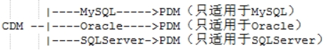 

 

在CDM转换为PDM过程中：

| ***\*CDM\****  | ***\*PDM\**** |
| -------------- | ------------- |
| 实体           | 表            |
| 属性           | 列            |
| 属性的数据类型 | 列的数据类型  |
| 主标识符       | 主键          |
| 一对多         | 外键          |
| 多对多         | 中间表        |

 

## **2、ER模型**

E-R模型也称实体-联系模型(Entity Relationship Model)，提供了实体、属性和联系的表示方法，用来描述现实世界的概念模型。它提供不受任何DBMS约束的面向用户的表达方法，在数据库设计中被广泛用作数据建模的工具。

### **（1）基本元素**

ER模型的基本元素是：实体、联系和属性。

### **（2）实体**

实体是现实世界中可区别于其它对象的“事件”或“物体“，它可能是有形的或无形的、具体或抽象的、有生命或无生命的。

 

实体可以被（粗略地）认为是名词，如计算机、雇员、歌曲、数学定理。

### **（3）联系**

关联捕获两个或更多实体相互如何关联，指发生在实体之间具有特定含义的对应关系。

 

联系可以被（粗略地）认为是动词，例如：

​	在公司和计算机之间的拥有关联，

​	在雇员和部门之间的管理关联，

​	在演员和歌曲之间的表演关联，

​	在数学家和定理之间的证明关联。

### **（4）属性**

属性表示实体（或联系）所具有的某方面特征。

 

实体和联系都可以有属性，例如：

​	雇员实体可以有一个身份证号属性；

​	购买关联可以有一个日期属性。

 

通常，实体和属性都是名词，那么怎么它们的区别是什么？

用户购买商品时，通常会填写一个或多个收货地址。现在可以分析出两个名词：用户、收货地址，并且用户拥有收货地址。根据数据库中最基本的规范条件：关系的每一个列必须是一个不可分的数据项，即不允许表中还有表。可以确认用户是一个实体，因为它包含了收货地址。

现在确认收货地址是否为属性或实体，这需要根据用户需求进行判断。如果收货地址仅仅只是一个简单的地址表示，那么它就是一个属性，因为不需要分隔它，也不需要解析它的内部含义。如果系统中需要对于不同地址的用户购买力和购买行为进行分析，那么收货地址仅仅做为属性是不合适的，因为现在需要将收货地址分为省、市、县、镇等，进而展开分析。

### **（5）主标识**

每个实体都必须有一个唯一标识实体的最小化集合，这个集合叫做实体的主标识。通常，主标识使用某一个特定属性表示，用于区别于其它实体对象。一般而言，不要使用多个属性组合来定义主标识。

 

***\*实际项目中如何设计主标识？\****

通常我们会使用一些业务上的唯一值来标识实体，这种使用方式在实际项目中是有问题的。随着业务的演变，主标识的定义可能会发生改变，这将导致值意义或值本身发生变化。通常主标识符被作为数据库的主键来实现数据表之间的关联，当主标识符的值发生改变时，所有主键和外键值都需要更改，在实际项目中发生这样的改变基本是不可行的。最典型的例子就是身份证号，从早期的15位升为现在的18位。

在实际项目中，通常选择一些无业务意义的值充当实体的主标识衔，例如自增长整数，GUID，这样就不需要再考虑主标识的意义或值发生改变。在简单项目中，通常使用自增长整数作为主标识，因为数据库本身提供了支持，非常简便易行。

### **（6）ER模型、关系模型和面向对象**

| ***\*ER模型\**** | ***\*关系模型\**** | ***\*面向对象\****             |
| ---------------- | ------------------ | ------------------------------ |
| 实体             | 表                 | 类                             |
| 属性             | 列                 | 属性                           |
| 主标识           | 主键               |                                |
| 关系(1:1)        | 外键（唯一约束）   | 一个对象包含另一个对象         |
| 关系(1:n)        | 外键               | 一个对象包含另一个对象的集合   |
| 关系(n:m)        | 中间表             | 两个对象分别包含对方的对象集合 |

 

### **（7）理解范式**

范式（Normal Form）是英国人E.F.Codd在上个世纪70年代提出关系数据库模型后总结出来的。范式是关系数据库理论的基础，也是在设计数据库结构过程中所要遵循的规则和指导方法。目前有迹可寻的共有8种范式，依次是：1NF，2NF，3NF，BCNF，4NF，5NF，DKNF，6NF。

通常所用到的只是前三个范式，即：第一范式（1NF），第二范式（2NF），第三范式（3NF）。

#### **A、第一范式（1NF）**

第一范式（1NF）强调的是列的原子性，即列不能够再分成其他几列。 

 

考虑这样一个表：

​	联系人（姓名，性别，电话） 

如果在实际场景中，一个联系人有家庭电话和公司电话，那么这种表结构设计就没有达到1NF。要符合1NF我们需要把列（电话）拆分，即：

​	联系人（姓名，性别，家庭电话，公司电话）

#### **B、第二范式（2NF）**

第二范式（2NF）首先要满足1NF，同时还需要满足另外两个条件：

1、表必须有一个主键，且主键值不能为空，主键值不能重复。

2、没有包含在主键中的列必须完全依赖于主键，不能只依赖于主键的一部分。

 

考虑一个订单明细表：

OrderDetail（OrderID，ProductID，UnitPrice，Discount，Quantity，ProductName）

 

在一个订单中可以订购多种产品，单独一个OrderID不足以成为主键，应该是（OrderID，ProductID）。在表中Discount（折扣）、Quantity（数量）完全依赖于主键（OderID，ProductID），但是UnitPrice，ProductName只依赖于ProductID。所以OrderDetail表不符合2NF。

 

不符合2NF的设计容易产生冗余数据，我们可以把OrderDetail表拆分为两张表，来消除原订单表中UnitPrice，ProductName多次重复的情况。

OrderDetail（OrderID，ProductID，Discount，Quantity）主键为（OderID，ProductID）

Product（ProductID，UnitPrice，ProductName）		主键为ProductID

#### **C、第三范式（3NF）**

第三范式（3NF）首先要满足2NF，同时还需要满足非主键列必须直接依赖于主键，不能存在传递依赖，即非主键列 A 依赖于非主键列 B，非主键列 B 依赖于主键的情况。

 

考虑一个订单表：

Order（OrderID，OrderDate，CustomerID，CustomerName，CustomerAddr，CustomerCity）

主键是（OrderID），其中OrderDate、CustomerID、CustomerName、CustomerAddr、CustomerCity等非主键列都完全依赖于主键（OrderID），所以Order表符合2NF。

 

现在问题是CustomerName，CustomerAddr，CustomerCity直接依赖的是CustomerID（非主键列），而不是直接依赖于主键，它是通过传递才依赖于主键，所以不符合3NF。

 

通过拆分Order为两张表来满足3NF。

Order（OrderID，OrderDate，CustomerID）

Customer（CustomerID，CustomerName，CustomerAddr，CustomerCity）

#### **D、总结**

第一范式（1NF）很好辨别，但是第二范式（2NF）和第三范式（3NF）的概念很容易混淆，区分它们的关键点在于：

2NF（部分依赖）：非主键列是否完全依赖于主键，还是依赖于主键的一部分。

3NF（传递依赖）：非主键列是直接依赖于主键，还是直接依赖于非主键列。

## **3、PowerDesigner使用**

PowerDesigner是一个数据库的设计工具，主要支持三类模型：面向对象模型（OOM，即UML模型）、概念数据模型（CDM，即E-R模型）、物理数据模型（PDM，即数据库存储模型）。通常使用PowerDesigner创建CDM和PDM。

### **（1）安装**

运行PowerDesigner的安装程序，使用默认设置一路Next即可。

破解：首先解压缩破解包，将其中的pdflm12.dll拷贝到安装的根目录中替换原来的文件。然后运行PowerDesigner，在Tools->License Parameters中选择破解包中的lic文件，按向导执行完成。现在重新启动PowerDesigner就实现了完全破解。

### **（2）开发流程**

1、首先是根据用户需求找出实体和关系，以及实体的属性和主标识符。

2、根据实体和关系创建概念数据模型（CDM）。

3、根据CDM自动生成指定数据库的物理数据模型（PDM）。

4、根据PDM自动生成指定数据库的创建数据库表的SQL脚本文件。

5、在数据库的客户端工具中执行SQL脚本文件，完成创建数据库。

### **（3）创建CDM模型**

1、使用New向导创建一个空白的CDM模型。这将打开一个空白设计界面，并且显示一个浮动工具条。如果不小心关闭了浮动工具条，在窗口的工具栏上打开右键菜单，选择Palette就可以重新打开浮动工具条。

2、在浮动工具条中，只需要使用Entity和Relationship两个按钮就可以创建ER图，其它按钮可以不需理会。

3、首先创建实体。在浮动工具条中选择Entity，在窗口中每次单击鼠标都会创建一个实体。双击鼠标左键，可以打开一个实体的属性对话框，在General中有Name和Code，其中Name中在PD中显示的名字，通常使用中文；Code是在后面生成SQL脚本中对应数据表的名字，通常使用英文。

4、然后创建实体之间的关系，在浮动工具条中选择Relationship，在窗口中选择一个实体后，按鼠标左键不放进行拖动，移动到另一个实体上释放，这样就会默认创建一对多关系。双击关系会出现关系的属性面板，这里也有Name和Code，作用和实体中一样。在Cardinalities标签中修改关系类型，直接选择对应的关系类型即可。

5、现在为各个实体增加属性。双击鼠标左键，可以打开一个实体的属性对话框。为了增加属性，打开Attributes标签页。

首先增加主标识符。双击每行的第一个按钮会打开属性定义的对话框。Name、Code和实体中作用一样，通常使用id作为主标识符名字的后缀。点击Data type后面的按钮，打开数据类型选择界面，常用数据类型有：Integer、Decimal、Float、Serial、Variable characters、Data & Time。选择Serial即可。在General标签页的下面有Primary identifier表示主标识符，Mandatory表示Not Null。这个字段是主标识符，因此需要选择Primary identifier。

 

| Integer             | 整数         | 目前Short integer等一般不会使用，因为现在机器配置高、硬盘容量大，不需要将整数区分的非常详细来节约空间等。 |
| ------------------- | ------------ | ------------------------------------------------------------ |
| Decimal             | 定位精度小数 | 和Float不同，可以非常准确的表示小数，通常用于表示钱的金额等需要非常准确的数。Decimal(8,3)表示数字总共有8位，其中小数有3位。 |
| Float               | 浮点数       | 精度和计算机本身有关。通常用于科学计算。                     |
| Serial              | 自增长整数   |                                                              |
| Variable characters | 可变长字符   | 它所占用的存储空间是实际字符的占用空间。实际项目中一般不使用Characters类型，这是一个定长字符，使用char(8)即使只有一个字符a，它也要分配8个字符空间，其余7个使用空格填充，即使程序读出也是8个字符长，其中一个a，七个空格。 |
| Data & Time         | 日期时间     |                                                              |
| Binary等            | 大二进制数据 | 通常不会使用。例如文件上传如何设计数据库？上传文件本身保存在服务器的文件系统中，而不是数据库中，在数据库中保存这个文件的在文件系统中的路径，因此只需设计一个Variable characters类型的字段即可。 |

 

现在依次加入其它的属性，每个属性都有Name、Code、Data type、Mandatory。

### **（4）根据CDM生成PDM**

1、打开CDM模型，选择Tools->Genrate PDM就可以启动生成向导。

2、在生成向导中需要选择数据库类型，然后确定就开始自动生成，最后会打开生成的PDM模型。注意：一定要选对数据库类型，很多时候错误就是没有选对数据库。

3、现在对比区别，发现有以下生成规则：

在CDM中每个实体都有一个主标识符，没有外键的概念。例如：班级和学生两个都有各自的主标识符，班级的主标识符并未出现在学生实体中。但是生成PDM后，班级的主标识符会加入到学生表中充当外键页，即在学生表中新增加了一个列。

在CDM中的多对多关系，在生成PDM时会自动增加一个中间表，并拆分成两个一对多关系。

### **（5）根据PDM生成SQL脚本**

1、打开PDM模型，选择Database->Genrate Database菜单打开生成脚本的对话框。

2、选择Script generation，不要选择Direct generation。现在选择文件保存的Directory和File name，然后点击“确定”就会生成SQL文件。

### **（6）在MySQL中运行SQL脚本创建数据库**

1、打开MySQL客户端，创建一个新的数据库，并切换为当前数据库。

2、打开File->Open Script，选择SQL脚本文件。

3、点击Execute执行脚本，即完成数据库创建。

# **五、SQL（DML）**

数据操作语言。用来操作数据库表中的记录（数据）。

## **1、DML操作（重要）**

DML用于向数据库表中插入（INSERT）、删除（DELETE）、修改（UPDATE）数据。不要与DDL混淆了，DDL是对数据表结构进行增、删、改的操作。

每次执行DML时，新增、修改、删除语句都是只能对一个表的内容进行改变。

 

***\*数据的字面值：\****

在mysql中，字符串类型和日期类型都要用单引号括起来。例如，'abc'，'2016-01-01'，'2016-01-01 00:00:00:000'。

空值使用 null 表示。

## **2、插入操作（INSERT）**

### **（1）语法**

INSERT INTO 表名 (列名1，列名2 ...) VALUES (列值1，列值2...);

 

注意：

1、插入的数据应与字段的数据类型、个数、顺序要一一对应。

2、在values中列出的数据位置必须与被加入的列的排列位置相对应。

3、数据的大小应在列的规定范围内，例如：不能将一个长度为80的字符串加入到长度为40的列中。

4、字符和日期型数据应包含在单引号中。

5、如果插入空值，请使用null，也可以不写入字段的值，直接将字段的默认值设为null。

### **（2）单行插入**

一次向数据表中只插入一条记录，这是最常见的操作情形。

 

例如，使用insert语句向department表中插入一个部门信息。

​	CREATE TABLE department(

​		id			INT not null auto_increment,

​		name		varchar(14) not null unique,

​		loc			varchar(13),

​		primary key(id)

​	);

 

​	INSERT INTO department(name) VALUES ("education");

 

使用insert语句向employee 表中插入三个员工信息。

​	CREATE TABLE employee (

​		id			INT not null auto_increment,

​		name		VARCHAR(50) not null,

​		job			VARCHAR(50),

​		manager		INT,

​		hiredate	DATE not null,

​		salary		DECIMAL(7,2),

​		bonus		DECIMAL(7,2) default 0,

​		deptid		INT not null,

​		primary key(id)

​	);

 

​	INSERT INTO employee(name,job,manager,hiredate,salary,bonus,deptid)

​		VALUES ('zhangsan','manager',null,'1990-5-10',10000,1000,1);

 

​	INSERT INTO employee(name,job,manager,hiredate,salary,bonus,deptid)

​		VALUES ('lisi','employee',null,'1995-5-10',10000,500,1);

 

​	INSERT INTO employee(name,job,manager,hiredate,salary,bonus)

​		VALUES ('wu','employee',null,'1995-5-10',10000,500,1);

### **（3）多行插入**

这是将多条记录插入到当前数据表中。

​	INSERT INTO employee(name,job,manager,hiredate,salary,bonus,deptid)

​		VALUES

​		('zhangsan','manager',null,'1990-5-10',10000,1000,1),

​		('lisi','employee',null,'1995-5-10',10000,500,1),

​		('wu','employee',null,'1995-5-10',10000,500,1);

### **（4）多行插入（子查询）**

这是将一个子查询的结果插入到当前数据表中。注意：子查询返回的列的个数和顺序，要和insert语句中列的个数的顺序要匹配。

 

例如，backup_employee和employee有相同的表结构，只是表名不同。

INSERT INTO backup_employee(name,job,manager,hiredate,salary,bonus,deptid) 

​	(SELECT name,job,manager,hiredate,salary,bonus,deptid FROM employee);

 

例如，backup_other_employee和employee的表结构不相同，backup_other_employee中只有两个字段（id,name），并且id不是自增长的。

INSERT INTO backup_other_employee(id,name)

​	(SELECT id,name FROM employee);

这种插入方式不需要两个表的结构相同，只要子查询结果的列和被插入表中的列相同即可。

## **3、更新操作（UPDATE）**

使用update语句修改表中数据。

### **（1）语法**

UPDATE 表名 SET 列名1=列值1，列名2=列值2 ... WHERE 列名=值

 

UPDATE语法可以使用新值更新原有表行中的各列。

SET子句指示要修改哪些列和要给予哪些值。

WHERE子句指定应更新哪些行。如没有WHERE子句，则更新所有的行。

 

注意：

1、update语句执行时，首先是根据where条件查看有那些记录需要更新，如果没有Where条件就表示修改所有记录。

2、update语句执行时，对于符合条件的每条记录依次执行更改操作，这是一个对所有符合条件记录的一个循环执行过程。

### **（2）例子**

在前面创建的employee表中修改表中的纪录。

 

将所有员工薪水修改为5000元。

​	UPDATE employee SET salary=5000;

 

将姓名为’zhangsan’的员工薪水修改为3000元。

​	UPDATE employee SET salary=3000 WHERE name='zhangsan';

 

将姓名为’lisi’的员工薪水修改为4000元,job改为ccc。

​	UPDATE employee SET salary=4000,job='ccc' WHERE name='lisi';

 

将wu的薪水在原有基础上增加1000元。

​	UPDATE employee SET salary=***\*salary\****+1000 WHERE name='wu';

## **4、删除操作（DELETE）**

### **（1）语法**

DELETE 表名 [WHERE 列名=值]

 

delete语句执行时，首先是根据where条件查看有那些记录需要删除。如果没有Where条件就表示删除所有记录，即清空表中所有数据。

 

注意：

Delete语句不能只删除某一列的值（可使用update更改）

使用delete语句仅删除记录，不删除表本身。如要删除表，使用drop table语句。

同insert和update一样，从一个表中删除记录将引起其它表的参照完整性问题，在修改数据库数据时，应该始终不要忘记这个潜在的问题。

删除表中数据也可使用TRUNCATE TABLE语句，它和delete有所不同，参看mysql文档。

### **（2）例子**

删除表中名称为'zhangsan'的记录。

​	DELETE FROM employee WHERE name='zhangsan';

 

删除表中所有记录。

​	DELETE FROM employee;

 

使用truncate删除表中记录。

​	TRUNCATE TABLE employee;

 

DELETE删除表中的数据，表结构还在。TRUNCATE删除是把表直接DROP掉，然后再创建一个同样的新表，删除的数据不能找回，但是执行速度比DELETE快。

### **（3）删除一对多关联**

有两张表（courese、score），通过外键约束实现一对多关系。由于score到course是多对一，因此外键在score表中建立，外键列是cid，参照course表中的id列。同时在外键上还有on delete restrict约束，表示score中有cid值时，在course中对应的id值不能被删除。

​	alter table score add constraint FK_c_sc foreign key (cid)

​		references course (id) on delete restrict on update restrict;	

 

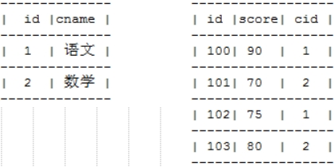 

在删除一对多关系中的数据时，一定要先删除多方表中对应的数据，然后才删除一方表中数据。例如，现在要删除course中id为2的记录，那么首先要删除score中所有cid为2的记录，然后才能删除course中id为2的记录。否则会抛出错误，提示不能删除。

​	delete score where cid=2;

​	delete courese where id=2;

# **六、SQL（DQL）（非常重要）**

数据库查询语句（DQL）不会对表中数据进行改变，而是返回查询结果集给客户端，返回的查询结果集相当于是一张虚表。

DQL具有丰富的数据查询功能，能够实现关系运算中的大多数运算，如选择、投影、连接、并等，并且还带有分组、排序、统计等数据处理功能。DQL的返回结果有多种可能，有可能为空、单值元组、一个多值元组等，若为单值元组时，此查询可以作为一个数据项出现在任何表达式中。

## **1、语法**

SELECT 列名 FROM 表名

​	[WHERE  GROUP BY  HAVING  ORDER BY]

 

SELECT selection_list					/*要查询的列名称*/

​	FROM table_list					/*要查询的表名称*/

​	WHERE condition					/*指定查询的条件或源表的连接条件*/

​	GROUP BY grouping_columns			/*对结果分组*/

​	HAVING condition					/*分组后的行条件*/

​	ORDER BY sorting_columns			/*对结果排序*/

​	LIMIT offset_start, row_count		/*返回结果行数限定*/

## **2、数据准备**

### **（1）学生表（student）**

CREATE TABLE student (

​	id			INT not null auto_increment,

​	no			VARCHAR(6) not null unique,

​	name		VARCHAR(50) not null,

​	age			INT,

​	gender		VARCHAR(50) not null,

​	primary key(id)

);

 

INSERT INTO student(no,name,age,gender) VALUES('S_1001', 'liuYi', 35, 'male');

INSERT INTO student(no,name,age,gender) VALUES('S_1002', 'chenEr', 15, 'female');

INSERT INTO student(no,name,age,gender) VALUES('S_1003', 'zhangSan', 95, 'male');

INSERT INTO student(no,name,age,gender) VALUES('S_1004', 'liSi', 65, 'female');

INSERT INTO student(no,name,age,gender) VALUES('S_1005', 'wangWu', 55, 'male');

INSERT INTO student(no,name,age,gender) VALUES('S_1006', 'zhaoLiu', 75, 'female');

INSERT INTO student(no,name,age,gender) VALUES('S_1007', 'sunQi', 25, 'male');

INSERT INTO student(no,name,age,gender) VALUES('S_1008', 'zhouBa', 45, 'female');

INSERT INTO student(no,name,age,gender) VALUES('S_1009', 'wuJiu', 85, 'male');

INSERT INTO student(no,name,age,gender) VALUES('S_1010', 'zhengShi', 5, 'female');

INSERT INTO student(no,name,age,gender) VALUES('S_1011', 'xxx', NULL, NULL);

### **（2）部门表（department）**

CREATE TABLE department(

​	id			INT not null,

​	name		varchar(14) not null unique,

​	loc			varchar(13),

​	primary key(id)

);

 

INSERT INTO department(id,name,loc) values(1, 'ACCOUNTING', 'NEW YORK');

INSERT INTO department(id,name,loc) values(2, 'RESEARCH', 'DALLAS');

INSERT INTO department(id,name,loc) values(3, 'SALES', 'CHICAGO');

INSERT INTO department(id,name,loc) values(4, 'OPERATIONS', 'BOSTON');

### **（3）雇员表（employee）**

CREATE TABLE employee (

​	id			INT not null,

​	name		VARCHAR(50) not null,

​	job			VARCHAR(50),

​	manager		INT,

​	hiredate	DATE not null,

​	salary		DECIMAL(7,2),

​	bonus		DECIMAL(7,2) default 0,

​	deptid		INT not null,

​	primary key(id)

);

 

INSERT INTO employee(id,name,job,hiredate,salary,bonus,manager,deptid) values(1,'KING','PRESIDENT','1981-11-17',5000,1000,NULL,1);

 

INSERT INTO employee(id,name,job,hiredate,salary,bonus,manager,deptid) values(1,'CLARK','MANAGER','1981-06-09',2450,1000,1,1);

INSERT INTO employee(id,name,job,hiredate,salary,bonus,manager,deptid) values(2,'MILLER','CLERK','1982-01-23',1300,NULL,1,1);

 

INSERT INTO employee(id,name,job,hiredate,salary,bonus,manager,deptid) values(3,'JONES','MANAGER','1981-04-02',2975,1000,1,2);

INSERT INTO employee(id,name,job,hiredate,salary,bonus,manager,deptid) values(4,'SCOTT','ANALYST','1987-04-19',3000,NULL,3,2);

INSERT INTO employee(id,name,job,hiredate,salary,bonus,manager,deptid) values(5,'FORD','ANALYST','1981-12-03',3000,800,3,2);

INSERT INTO employee(id,name,job,hiredate,salary,bonus,manager,deptid) values(6,'ADAMS','CLERK','1987-05-23',1100,NULL,3,2);

INSERT INTO employee(id,name,job,hiredate,salary,bonus,manager,deptid) values(7,'SMITH','CLERK','1980-12-17',800,800,3,2);

 

INSERT INTO employee(id,name,job,hiredate,salary,bonus,manager,deptid) values(8,'BLAKE','MANAGER','1981-05-01',2850,800,1,3);

INSERT INTO employee(id,name,job,hiredate,salary,bonus,manager,deptid) values(9,'ALLEN','SALESMAN','1981-02-20',1600,NULL,8,3);

INSERT INTO employee(id,name,job,hiredate,salary,bonus,manager,deptid) values(10,'WARD','SALESMAN','1981-02-22',1250,500,8,3);

INSERT INTO employee(id,name,job,hiredate,salary,bonus,manager,deptid) values(11,'MARTIN','SALESMAN','1981-09-28',1250,NULL,8,3);

INSERT INTO employee(id,name,job,hiredate,salary,bonus,manager,deptid) values(12,'JAMES','CLERK','1981-12-03',950,1000,8,3);

INSERT INTO employee(id,name,job,hiredate,salary,bonus,manager,deptid) values(13,'TURNER','SALESMAN','1981-09-08',NULL,0,8,3);

## **3、基础查询**

### **（1）查询所有列**

SELECT * FROM student;

 

虽然技术上是没有问题的，但是使用 * 替代字段列表是一种不好的写法。使用 * 号后，开发人员不清楚到底希望返回那些字段，容易引起歧义。使用 * 号后，可能我们只希望返回一个列，但是现在会返回所有列，不仅数据库系统处理的数据要多，而且网络占用的带宽也大。例如：

​	select * from student;

我们应该明确的列出字段列表，表示我们是希望返回那些字段。

​	select id,no,name,age,gender from student;

### **（2）查询指定列**

SELECT id,name,age FROM student;

## **4、条件查询**

### **（1）条件查询介绍**

条件查询就是在查询时给出WHERE子句，其中可以使用如下运算符及关键字：

| =、!=、<>、<、<=、>、>= | 比较运算符，注意 = 是等于，<> 是不等于   |
| ----------------------- | ---------------------------------------- |
| BETWEEN…AND             | 值区间测试                               |
| [NOT] IN(set)           | 判断值是否在某个集合（子查询）范围中     |
| [NOT] EXISTS(set)       | 判断值是否在某个集合（子查询）范围中存在 |
| IS NULL                 | 是否为NULL                               |
| AND                     | 与                                       |
| OR                      | 或                                       |
| NOT                     | 非                                       |

 

### **（2）实例**

***\*1、查询性别为女，并且年龄小于50的记录\****

​	SELECT * FROM student WHERE gender='female' AND age<50;

 

***\*2、查询学号为S_1001，或者姓名为liSi的记录\****

​	SELECT * FROM student WHERE no ='S_1001' OR sname='liSi';

 

***\*3、查询学号为S_1001，S_1002，S_1003的记录\****

​	SELECT * FROM student WHERE no IN ('S_1001', 'S_1002', 'S_1003');

 

***\*4、查询学号不是S_1001，S_1002，S_1003的记录\****

​	SELECT * FROM student WHERE no NOT IN ('S_1001','S_1002','S_1003');

 

***\*5、查询年龄为null的记录\****

​	SELECT * FROM student WHERE age IS NULL;

 

***\*6、查询年龄在20到40之间的学生记录\****

​	SELECT * FROM student WHERE age>=20 AND age<=40;

​	或者

​	SELECT * FROM student WHERE age BETWEEN 20 AND 40;

​	

​	注意：between通常对数字或日期进行比较，小的值在between之后，大的值在and之后。例如：

​	SELECT * FROM employee where hiredate between '2016-01-01' and '2016-02-02';

 

***\*7、查询性别非男的学生记录\****

​	SELECT * FROM student WHERE gender != 'male';

​	或者

​	SELECT * FROM student WHERE gender <> 'male';

​	或者

​	SELECT * FROM student WHERE NOT gender = 'male';

 

***\*8、查询姓名不为null的学生记录\****

​	SELECT * FROM student WHERE NOT sname IS NULL;

​	或者

​	SELECT * FROM student WHERE sname IS NOT NULL;

​	

***\*9、查询没有员工的部门信息\****

​	SELECT * FROM department WHERE id NOT IN (select distinct deptid FROM employee)

IN是取出每条记录中的值，依次和集合进行比较。在集合内则返回true，不在集合中则返回false。

## **5、模糊查询**

当想查询姓名中包含字母a的学生时，就需要使用模糊查询了。模糊查询需要使用关键字 [NOT] LIKE。

### **（1）通配符**

| _    | 任意一个字母                              |
| ---- | ----------------------------------------- |
| %    | 任意0~n个字母。例如，'%张'、'%张%'、'张%' |

 

注意表达式的写法：

| '%语%' | 表示只要字符串中有"语"字就匹配 |
| ------ | ------------------------------ |
| '语%'  | 表示字符串必须以"语"字开头     |
| '%语'  | 表示字符串必须以"语"字结尾     |

 

注意：LIKE运算符尽量少用，因为它无法使用索引。执行like操作时，必须依次遍历数据表中所有数据行，当数据行较多时，效率会很低。

### **（2）例子**

***\*1、查询姓名由5个字母构成的学生记录\****

​	SELECT * FROM student WHERE name LIKE '_____';

​	模糊查询必须使用LIKE关键字。其中 “_”匹配任意一个字母，5个“_”表示5个任意字母。

 

***\*2、查询姓名由5个字母构成，并且第5个字母为“i”的学生记录\****

​	SELECT * FROM student WHERE sname LIKE '____i';

 

***\*3、查询姓名以“z”开头的学生记录\****

​	SELECT * FROM student WHERE sname LIKE 'z%';

​	其中“%”匹配0~n个任何字母。

 

***\*4、查询姓名中第2个字母为“i”的学生记录\****

​	SELECT * FROM student WHERE sname LIKE '_i%';

 

***\*5、查询姓名中包含“a”字母的学生记录\****

​	SELECT * FROM student WHERE sname LIKE '%a%';

## **6、字段控制查询**

### **（1）去除重复记录**

例如，employee表中salary字段就可以有相同的值。如果仅仅查询employee表的salary字段，就会出现重复记录。

使用DISTINCT去除重复记录：

​	SELECT DISTINCT salary FROM employee;

### **（2）查看雇员的月薪与佣金之和**

因为salary和bonus两列的类型都是数值类型，所以可以做加运算。如果salary或bonus中有一个字段不是数值类型，那么会出错。

​	SELECT *,salary+bonus FROM employee;

 

在bonus列中有很多值为NULL。由于任何数据与NULL相加结果还是NULL，所以结果可能会出现NULL。下面使用了把NULL转换成数值0的函数IFNULL：

​	SELECT *,salary+IFNULL(bonus,0) FROM employee;

### **（3）给列名添加别名**

在上面查询中出现列名为salary+IFNULL(bonus,0)，这很不美观，现在我们给这一列给出一个别名，为total：

​	SELECT *, salary+IFNULL(bonus,0) AS total FROM employee;

 

给列起别名时，可以省略AS关键字：

​	SELECT *,salary+IFNULL(bonus,0) total FROM employee;

## **7、排序**

ORDER BY选项只能用在最外层的查询语句中，不能在子查询中使用，否则会报错。ORDER BY最后执行，默认排升序。

 

***\*1、查询所有学生记录，按年龄升序排序\****

​	SELECT * FROM student ORDER BY age ASC;

​	或者

​	SELECT * FROM student ORDER BY age;

 

***\*2、查询所有学生记录，按年龄降序排序\****

​	SELECT * FROM student ORDER BY age DESC;

 

***\*3、查询所有雇员，按月薪降序排序，如果月薪相同时，按入职日期升序排序\****

​	SELECT * FROM employee ORDER BY salary DESC,hiredate ASC;

## **8、聚合函数**

聚合函数是用来做纵向运算的函数：

| ***\*COUNT()\**** | 统计指定列不为NULL的记录行数                                 |
| ----------------- | ------------------------------------------------------------ |
| ***\*MAX()\****   | 计算指定列的最大值，如果指定列是字符串类型，那么使用字符串排序运算 |
| ***\*MIN()\****   | 计算指定列的最小值，如果指定列是字符串类型，那么使用字符串排序运算 |
| ***\*SUM()\****   | 计算指定列的数值和，如果指定列类型不是数值类型，那么计算结果为0 |
| ***\*AVG()\****   | 计算指定列的平均值，如果指定列类型不是数值类型，那么计算结果为0 |

 

### **（1）COUNT**

当需要纵向统计时可以使用COUNT()。

 

***\*1、查询employee表中记录数：\****

​	SELECT COUNT(*) AS cnt FROM employee;

 

***\*2、查询employee表中有奖金的人数：\****

​	SELECT COUNT(bonus) cnt FROM employee;

注意，因为count()函数中给出的是bonus列，那么只统计bonus列中非NULL值的行数。

 

***\*3、查询employee表中月薪大于2500的人数：\****

​	SELECT COUNT(*) FROM employee WHERE salary > 2500;

 

***\*4、统计月薪与奖金之和大于2500元的人数：\****

​	SELECT COUNT(*) AS cnt FROM employee WHERE salary+IFNULL(bonus,0) > 2500;

 

***\*5、查询有奖金的人数，以及有领导的人数：\****

​	SELECT COUNT(bonus), COUNT(manager) FROM employee;

### **（2）SUM和AVG**

当需要纵向求和时使用sum()函数。

 

***\*1、查询所有雇员月薪和：\****

​	SELECT SUM(salary) FROM employee;

 

***\*2、查询所有雇员月薪和，以及所有雇员奖金和：\****

​	SELECT SUM(salary), SUM(bonus) FROM employee;

 

***\*3、查询所有雇员月薪+奖金和：\****

​	SELECT SUM(salary+IFNULL(bonus,0)) FROM employee;

 

***\*4、统计所有员工平均工资：\****

​	SELECT AVG(salary) FROM employee;

### **（3）MAX和MIN**

查询最高工资和最低工资：

​	SELECT MAX(salary), MIN(salary) FROM employee;

## **9、分组查询**

GROUP BY子句实现分组查询。例如，查询每个部门的工资总和，这要使用分组来实现。注意：凡是和返回结果中聚合函数同时出现的列名，一定要作为GROUP BY中分组的列。

### **（1）分组查询**

***\*1、查询每个部门的部门编号和每个部门的工资和：\****

​	SELECT deptid, SUM(salary) FROM employee GROUP BY deptid;

 

***\*2、查询每个部门的部门编号以及每个部门的人数：\****

​	SELECT deptid, COUNT(*) FROM employee GROUP BY deptid;

 

***\*3、查询每个部门的部门编号以及每个部门工资大于1500的人数：\****

​	SELECT deptid, COUNT(*) FROM employee WHERE salary>1500 GROUP BY deptid;

### **（2）HAVING子句**

查询工资总和大于9000的部门编号以及工资和：

SELECT deptid, SUM(salary) FROM employee GROUP BY deptid HAVING SUM(salary) > 9000;

 

注意：having与where的区别：

1、having是在分组后对数据进行过滤，where是在分组前对数据进行过滤。

2、having可以使用分组函数(统计函数)，where不可以使用分组函数。

3、WHERE是对分组前记录的过滤条件，如果某行记录没有满足WHERE子句要求，那么这行记录不会参加分组；而HAVING是对分组后数据的过滤条件。

### **（3）ORDER BY**

ORDER BY和GROUP BY、HAVING一起使用时，ORDER BY只能对最终结果排序，即用在查询语句的最外层。如果对于内部的子查询排序，则出现错误。

select c.id,c.name,avg(sc.score) avgscore from score sc,course c where sc.cid=c.id group by c.id having avgscore>75 order by score;

## **10、LIMIT（MySQL特有）**

这是MySQL特有的关键字，通常用于分页处理。

### **（1）语法**

在SELECT语句中使用LIMIT子句来约束结果集中的行数。LIMIT子句语法：

​	SELECT 

​		column1,column2,...

​	FROM

​		table

​	LIMIT offset , count;

 

LIMIT子句接受一个或两个参数。两个参数的值必须为零或正整数。

1、offset参数指定要返回结果中的第一行的偏移量。数据库看所有满足要求的结果中的第一行记录的偏移量为0，而不是1。

2、count参数指定要返回的最大行数。

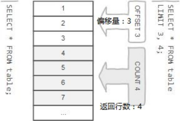 

 

使用带有一个参数的LIMIT子句时，此参数将用于确定从结果集的开头返回的最大行数。

​	SELECT

​		column1,column2,...

​	FROM

​		table

​	LIMIT count;

上面的查询等同于下面接受两个参数的LIMIT子句的查询：

​	SELECT

​		column1,column2,...

​	FROM

​		table

​	LIMIT 0 , count;

### **（2）实例**

***\*1、查询5行记录，起始行从0开始\****

​	SELECT * FROM emp LIMIT 0, 5;

​	注意，起始行从0开始，即第一行开始！

 

***\*2、查询10行记录，起始行从3开始\****

​	SELECT * FROM emp LIMIT 3, 10;

 

***\*3、分页查询\****

​	如果每页记录数为10条，那么希望查看第3页记录应该怎么查呢？

​	第一页记录起始行为0，一共查询10行；

​	第二页记录起始行为10，一共查询10行；

​	第三页记录起始行为20，一共查询10行；

​	-- SELECT * FROM employee LIMIT ((page-1)*pageSize), pageSize;

 

​	语句如下：

​		SELECT * FROM emp LIMIT 20, 10;

 

***\*4、分页查询\****

查询语句书写顺序：select – from - where - group by - having - order by - limit

查询语句执行顺序：from - where - group by - having - select - order by - limit

​	

例如：

select c.id,c.name,avg(sc.score) avgscore from score sc,course c where sc.cid=c.id group by c.id having avgscore>75 order by score limit 20, 10;

# **七、SQL（多表DQL）（重要）**

## **1、简介**

多表查询有如下几种：

| ***\*合并结果集\**** |                    |                   | UNION、UNION ALL |
| -------------------- | ------------------ | ----------------- | ---------------- |
| ***\*连接查询\****   | 内连接             |                   | [INNER] JOIN  ON |
| 外连接               | 左外连接           | LEFT [OUTER] JOIN |                  |
| 右外连接             | RIGHT [OUTER] JOIN |                   |                  |
| 自然连接             |                    | NATURAL JOIN      |                  |
| ***\*子查询\****     |                    |                   |                  |

 

## **2、合并结果集**

将两个或更多查询的结果集组合为单个结果集，该结果集包含联合查询中的所有查询的全部行。合并结果集的列名与UNION运算符中第一个Select语句的结果集的列名相同，另一个Select语句的结果集中列名将被忽略。

有两种不同的用法UNION和UNION ALL。UNION从结果集中删除重复的行，UNION ALL 将包含所有行并且不删除重复的行。

 

这个操作要求被合并的两个结果集的列数目、列类型和列顺序必须相同。

### **（1）样例数据**

例如，department和backup_department的表结构是一样的。其中department数据：

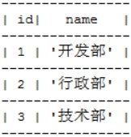 

backup_department中数据：

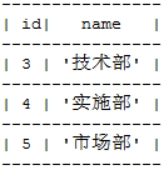 

### **（2）UNION**

UNION用于去除重复记录。这里重复是指两条记录的内容都是完全一样的。

 

现在，执行下面的语句：

SELECT id,name,loc FROM department UNION SELECT id,name,loc FROM backup_department;

合并后的结果如下：

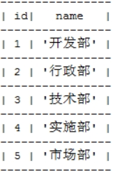 

### **（3）UNION ALL**

不去除重复记录，例如：

SELECT id,name,loc FROM department UNION ALL SELECT id,name,loc FROM backup_department;

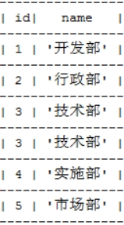 

## **3、连接查询（非常重要）**

在SQL中，大多数SQL查询都会涉及到多表，这将使用表之间的关系进行关联，从而得出查询结果。

### **（1）准备演示数据**

course表中有如下数据：

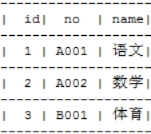 

score表中有如下数据：

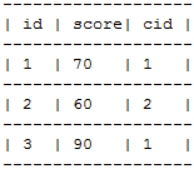 

### **（2）笛卡尔积**

假设集合A={a,b}，集合B={0,1,2}，它们的笛卡尔积为{(a,0),(a,1),(a,2),(b,0),(b,1),(b,2)}，即两个集合中的元素两两组合。同理可以扩展到多个集合的情况。

数据库中的多表连接查询就是求出多个表的笛卡尔积。例如，course连接score，course中有5条记录，score中有3条记录，那么查询出的结果就是5*3。

 

from中提供查询的基本表或视图，这是一个典型的笛卡尔积的计算。例如，执行下面的两表连接查询语句：

select * from course c, score sc

由于没有where条件过滤，这将获得一个笛卡尔积的结果，总记录条数是 3*3=9。

### **（3）问题**

在上面例子中，多表查询产生这样的结果并不是我们想要的，那么怎么去除重复的、不想要的记录呢？当然是通过判断条件过滤。

 

通常要查询的多个表之间都存在关联关系，那么就可以通过关联关系去除笛卡尔积。在SQL语句中有三种连接方式：左连接（left join）、右连接（right join）和内连接（inner join）。

### **（4）内连接（inner join）**

在数据库中，关联关系通常使用主外键来表示。我们就需要使用主外键关系做为条件来去除无用信息。

#### **A、*****\*最常见的内连接\****

内连接是查询语句的默认格式，使用主外键关系做为条件来去除无用信息。在SQL语句中，多表关联默认就是内连接。在上面的例子中，加入下面的where条件：

​	select c.no,c.name,sc.score from course c, score sc where c.id = sc.cid;

这就是一个典型的中间关联的SQL语句。where c.id = sc.cid要求在一条笛卡尔集的记录中，要满足course表中的id值和sc表中的cid值相等。

#### **B、内连接**

在实际编程中不会使用这种方式。

 

基于inner join实现的内连接，和where语句等价。

​	select c.no,c.name,sc.score from course c inner join score sc on c.id=sc.cid;

在from选项中使用inner join score sc on c.id=sc.cid表示，其中inner join表示中间连接，score是被连接的表，on c.id=sc.cid表示连接条件。

#### **C、返回字段列表**

上面查询结果会把两张表的所有列都查询出来，也许你不需要那么多列，这时就可以指定要查询的列了。

​	select c.no, c.name from ...

这表示只返回结果集中c.no, c.name的值，其它列就会忽略掉。同时，对于合并相同的记录集，只会返回一条记录。

 

可以为表指定别名，然后在引用列时使用别名即可。

​	select c.no,c.name,sc.score from course c, score sc where c.id = sc.cid;

这里course的别名就是 c，score的别名就是 sc。

#### **D、内连接的特点**

查询结果必须满足条件。例如，上面的SQL中就必须满足 c.id = sc.cid。

### **（5）左连接**

左连接的目的：即使关联的右边没有值，也要保证一定会查出左边的结果，此时右边的值使用null表示。

 

例子，查询出所有课程，如果课程有成绩也将一起查出。

​	select c.no, sc.score from course c left join score sc on c.id=sc.cid;

这里将显示course中所有的课程信息，sc中有数据就显示数据，没有就显示NULL。

### **（6）右连接**

右连接的目的：即使关联的左边没有值，也要保证一定会查出右边的结果，此时左边的值使用null表示。

 

例子，查询出所有课程，如果课程有成绩也将一起查出。

select c.no, sc.score from score sc right join course c on c.id=sc.cid;

这里将显示course中所有的课程信息，sc中有数据就显示数据，没有就显示NULL。和上面的例子相比，这里将course和score两个的位置互换了，但是运行结果和上面是一样的。

### **（7）连接查询总结**

连接不限制仅仅两张表，也可以是三张、四张，甚至N张表的连接查询。通常连接查询不可能需要整个笛卡尔积，而只是需要其中一部分，这时就需要使用条件来去除不需要的记录。这个条件大多数情况下都是使用主外键关系实现。

两张表的连接查询一定有一个主外键关系，三张表的连接查询就一定有两个主外键关系，所以在大家不是很熟悉连接查询时，首先要学会去除无用笛卡尔积，那么就是用主外键关系作为条件来处理。如果两张表的查询，那么至少有一个主外键条件，三张表连接至少有两个主外键条件。

### **（8）自然连接（了解）**

连接查询会产生无用笛卡尔积，通常使用主外键关系等式来去除它。而自然连接无需你去给出主外键等式，它会自动找到这一等式，即两张连接的表中名称和类型完全一致的列作为条件。

例如，emp和dep表都存在deptno列，并且类型一致，所以会被自然连接找到！

SELECT * FROM emp NATURAL JOIN dept;

SELECT * FROM emp NATURAL LEFT JOIN dept;

SELECT * FROM emp NATURAL RIGHT JOIN dept;

## **4、子查询（非常重要）**

子查询也叫嵌套查询，是指在select子句或者where子句中又嵌入select查询语句,子查询的语句放在小括号之内。

### **（1）子查询**

1、子查询出现的位置有两个。在where后作为查询条件的一部分；在from后作为虚表。

2、当子查询出现在where后作为条件时，还可以使用any、all关键字。

3、子查询结果集有四种形式：单行单列（用于条件）、单行多列（用于条件）、多行单列（用于条件）、多行多列（用于表）。

### **（2）单行单列**

子查询作为条件，返回结果形式为单行单列。当子查询只返回一个列，并且这个列中只有一个值，因此子查询返回的实际是单个值。现在可以将子查询作为一个值使用，例如比较大小等。

 

***\*1、工资高于JONES的员工。\****

分析查询条件：工资>JONES工资，其中JONES工资需要使用子查询查出。

 

第一步：查询JONES的工资

​	SELECT salary FROM employee WHERE name='JONES';

 

第二步：查询高于JONES工资的员工

​	SELECT * FROM employee WHERE salary > ({JONES工资})

 

结果：

​	SELECT * FROM employee WHERE salary > (SELECT salary FROM employee WHERE name='JONES')

 

***\*2、查询与SCOTT同一个部门的员工。\****

SELECT * FROM employee WHERE deptid = (SELECT deptid FROM employee WHERE name='JONES')

### **（3）多行单列** 

子查询作为条件，返回结果形式为多行单列。当子查询结果集形式为多行单列时可以使用ALL或ANY关键字。

 

***\*1、工资高于30号部门所有人的员工信息\****

分析查询条件：工资高于30号部门所有人工资，其中30部门所有人工资是子查询。高于所有需要使用all关键字。

 

第一步：查询30号部门所有人工资

​	SELECT salary FROM employee WHERE deptid=30;

 

第二步：查询高于30号部门所有人工资的员工信息

​	SELECT * FROM employee WHERE salary > ALL ({第一步})

 

结果：

​	SELECT * FROM employee WHERE salary > ALL (SELECT salary FROM employee WHERE deptid=30;

 

也可以使用MAX函数获得最高的工资，这是上面语句的等价形式：

​	SELECT * FROM employee WHERE salary>(SELECT MAX(salary) FROM employee WHERE deptid=30);

### **（4）单行多列**

子查询作为条件，返回结果形式为单行多列。

 

***\*1、查询工作和工资与MARTIN（马丁）完全相同的员工信息\****

分析查询条件：工作和工资与MARTIN完全相同，使用子查询实现。

 

第一步：查询出MARTIN的工作和工资

​	SELECT job,salary FROM employee WHERE name='MARTIN'

 

第二步：查询出与MARTIN工作和工资相同的人

​	SELECT * FROM employee WHERE (job,salary) IN ({第一步})

 

结果：

​	SELECT * FROM employee WHERE (job,salary) IN (SELECT job,salary FROM employee WHERE name='MARTIN')

 

***\*2、有2个以上直接下属的员工信息\****

SELECT * FROM employee WHERE id IN( SELECT manager FROM employee GROUP BY manager HAVING COUNT(manager)>=2 );

### **（5）多行多列**

子查询作为虚表在form后出现，返回结果形式为多行多列。

 

***\*1、查询员工编号为3的员工名称、员工工资、部门名称、部门地址\****

分析：不使用子查询的实现

查询列：员工名称、员工工资、部门名称、部门地址

查询表：employee和department，分析得出不需要外连接（外连接的特性：某一行（或某些行）记录上会出现一半有值，一半为NULL值）

查询条件：员工编号为7788

 

第一步：首先只查一张表，这里只查员工表

​	SELECT name, salary FROM employee e WHERE id=3

 

第二步：让第一步结果与department做内连接查询，添加主外键条件去除无用笛卡尔积

​	SELECT e.name, e.salary, d.name, d.loc FROM employee e, department d WHERE e.deptid=d.id AND e.id=3

 

分析：演示子查询的做法：

第二步中的department表示一张完整的表，这里可以把department替换成所有行，但只有name和loc列的表，这需要子查询。

现在，查询department表中name和loc两列，因为id会被s作为条件，用来去除无用笛卡尔积，所以也需要查询它。

​	SELECT name,loc,id FROM department;

 

替换第二步中的department：

​	SELECT e.name, e.salary, d.name, d.loc FROM employee e, (SELECT name,loc,id FROM department) d WHERE e.deptid=d.id AND e.id=3

## **5、自连接**

表和自己连接，需要为表取别名。

 

***\*1、求3号员工的编号、姓名、经理编号和经理姓名\****

SELECT e1.id, e1.name, e2.manager, e2.name FROM employee e1, employee e2 

​	WHERE e1.manager = e2.id AND e1.id = 3;

 

（2）求各个部门薪水最高的员工所有信息

select e.* from employee e, 

​	(select max(salary) maxsal,deptid from employee group by deptid) a--部门最高工资

​	where e.deptid = a.deptid

​	and e.salary =a.maxsal

# **八、SQL函数** 

## **1、聚合函数**

聚合函数是用来做纵向运算的函数，即对多行中同一列进行运算的函数。

| ***\*COUNT()\**** | 统计指定列不为NULL的记录行数                                 |
| ----------------- | ------------------------------------------------------------ |
| ***\*MAX()\****   | 计算指定列的最大值，如果指定列是字符串类型，那么使用字符串排序运算 |
| ***\*MIN()\****   | 计算指定列的最小值，如果指定列是字符串类型，那么使用字符串排序运算 |
| ***\*SUM()\****   | 计算指定列的数值和，如果指定列类型不是数值类型，那么计算结果为0 |
| ***\*AVG()\****   | 计算指定列的平均值，如果指定列类型不是数值类型，那么计算结果为0 |

 

### **（1）COUNT**

当需要纵向统计时可以使用COUNT()。

 

***\*1、查询employee表中记录数：\****

​	SELECT COUNT(*) AS cnt FROM employee;

 

***\*2、查询employee表中有奖金的人数：\****

​	SELECT COUNT(bouns) cnt FROM employee;

注意，因为count()函数中给出的是bouns列，那么只统计bouns列中非NULL的行数。

 

***\*3、查询employee表中月薪大于2500的人数：\****

​	SELECT COUNT(*) FROM employee WHERE salary > 2500;

 

***\*4、统计月薪与奖金之和大于2500元的人数：\****

​	SELECT COUNT(*) AS cnt FROM employee WHERE salary+IFNULL(bouns,0) > 2500;

 

***\*5、查询有奖金的人数，以及有领导的人数：\****

​	SELECT COUNT(bouns), COUNT(manager) FROM employee;

### **（2）SUM和AVG**

当需要纵向求和时使用sum()函数。

 

***\*1、查询所有雇员月薪和：\****

​	SELECT SUM(salary) FROM employee;

 

***\*2、查询所有雇员月薪和，以及所有雇员奖金和：\****

​	SELECT SUM(salary), SUM(bouns) FROM employee;

 

***\*3、查询所有雇员月薪+奖金和：\****

​	SELECT SUM(salary+IFNULL(bouns,0)) FROM employee;

 

***\*4、统计所有员工平均工资：\****

​	SELECT SUM(salary), COUNT(salary) FROM employee;

​	或者

​	SELECT AVG(salary) FROM employee;

### **（3）MAX和MIN**

查询最高工资和最低工资：

​	SELECT MAX(salary), MIN(salary) FROM employee;

## **2、时间日期相关函数** 

| NOW()                                     | 当前日期时间                               |
| ----------------------------------------- | ------------------------------------------ |
| CURRENT_DATE()                            | 当前日期                                   |
| CURRENT_TIME()                            | 当前时间                                   |
| CURRENT_TIMESTAMP()                       | 当前时间戳                                 |
| YEAR\|Month\|DATE(datetime)               | 年月日                                     |
| DATE(datetime )                           | 返回datetime的日期部分                     |
| DATE_ADD(date2 , INTERVAL d_value d_type) | 在date2中加上日期或时间                    |
| DATE_SUB(date2 , INTERVAL d_value d_type) | 在date2上减去一个时间                      |
| ADDTIME(date2, time_interval)             | 将time_interval加到date2                   |
| DATEDIFF(date1 ,date2)                    | 两个日期差，返回天数                       |
| timediff(time1,time2)                     | 两个日期相减 time1 - time2，返回 time 差值 |
| DATE_FORMAT(time, '%Y%m%d')               | 日期格式化。这是'%Y%m%d'，可定制。         |

 

***\*1、查询2016年入职的员工\****

​	select * from employee where YEAR(hiredate) = 2016;

​	select * from employee where DATE_FORMAT(time, '%Y') = '2016';

 

***\*2、查询2016年6月入职的员工\****

​	select * from employee where YEAR(hiredate) = 2016 and Month(hiredate) = 6;

​	select * from employee where DATE_FORMAT(time, '%Y%m') = '201606';

 

***\*3、查询入职刚好6个月的员工\****

​	select * from employee where hiredate between date_sub(now(),interval 6 month) and now();

 

***\*4、查询入职满6个月的员工\****

​	select * from employee where date_sub(now(),interval 6 month) > hiredate;

 

***\*5、查询入职满30天的员工\****

​	select * from employee where DATEDIFF(new(), hiredate) >= 30;

 

***\*6、查询一个月内入职的员工\****

​	select * from employee where date_format(hiredate,'%Y%m')=date_format(DATE_SUB(now(), INTERVAL 1 MONTH),'%Y%m');

## **3、字符串相关函数**

| CHARSET(str)                        | 返回字符串字符集                                     |
| ----------------------------------- | ---------------------------------------------------- |
| CONCAT(string2 [,... ])             | 连接字符串                                           |
| INSTR(string,substring)             | 返回substring在string中出现的位置，没有返回0         |
| UCASE(string2)                      | 转换成大写                                           |
| LCASE(string2)                      | 转换成小写                                           |
| LEFT(string2,length)                | 从string2中的左边起取length个字符                    |
| LENGTH(string)                      | string长度                                           |
| REPLACE(str,search_str,replace_str) | 在str中用replace_str替换search_str                   |
| STRCMP(string1,string2)             | 逐字符比较两字串大小                                 |
| SUBSTRING(str,position [,length])   | 从str的position开始取length个字符。position是从1开始 |
| LTRIM(string2)                      | 去除前端空格                                         |
| RTRIM(string2)                      | 去除后端空格                                         |
| trim(string2)                       | 去除两端空格                                         |

 

***\*1、按“部门名-员工名”显示所有员工信息\****

​	SELECT CONCAT(d.name, '-', e.name) FROM department d, employee e where d.id=e.deptid;

 

***\*2、查看部门名长度大于5的名字\****

​	SELECT name FROM department WHERE LENGTH(name) > 5;

 

***\*3、查看部门位置，转为全小写，去除两边的空格，显示其前三个字符\****

​	SELECT SUBSTRING(TRIM(LCASE(loc)), 0, 3) FROM deparment;

## **4、数学相关函数**

| ABS(number2)                    | 绝对值         |
| ------------------------------- | -------------- |
| BIN(decimal_number)             | 十进制转二进制 |
| CEILING(number2)                | 向上取整       |
| CONV(number2,from_base,to_base) | 进制转换       |
| FLOOR(number2)                  | 向下取整       |
| FORMAT(number,decimal_places)   | 保留小数位数   |
| HEX(DecimalNumber)              | 转十六进制     |
| LEAST(number,number2 [,..])     | 求最小值       |
| MOD(numerator,denominator)      |                |
| RAND([seed])                    | 随机数         |

 

1、求模

SELECT MOD(234, 10);

SELECT MOD(id, 10) from department;

# **九、如何编写SQL语句**

## **1、首先判断是什么类型的数据操作？**

对于数据操作而言，只有四种语句：insert、update、delete、select。

## **2、找出待操作的数据表**

分析操作涉及到那些数据，分析这些数据分布在那些数据表中？

## **3、分析数据表之间的关系？**

数据表之间关系通常是通过主外键实现。

在第2步中已经找到了与数据相关的表，这里还可以通过关系分析，可能会找到一些关联操作的中间表。

## **4、编写CUD语句**

这种语句通常是对单表中数据进行更改。主要分析：

1、更改的数据项

2、数据行的查找条件。在条件中注意子查询的使用。

## **5、编写R语句**

这种语句通常会对多表操作，并且会涉及到较复杂的关系。主要分析：

1、返回的数据列

2、涉及的数据表和数据表之间的关系。判断当前表之间使用的连接类型，有三种：中间连接、左连接、右连接。

3、查询条件设计。需要参考需求，看需求中有那些条件约束，根据约束选择运算符。注意可能使用子查询。

4、查看有无分组统计要求，如果有则需要判断根据那个列进行分组统计。

5、最后看是否需要对查询结果排序，如果有则确定排序列。

 

例如，查询课程成绩有三个以上的课程数据：

SELECT * FROM course c

WHERE  EXISTS

(

​	SELECT cid

​	FROM  sc

​	WHERE c.cid=sc.cid

​	GROUP BY cid

​	HAVING COUNT(*) > 3

)

 

下面语句的执行流程：

select * from course c where exists (select cid from sc where c.cid=sc.cid group by cid having count(*)>=3);

 

***\*1、执行查询语句 from course c\****

这将获得一个笛卡尔集，这里是course表中的所有记录：

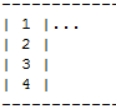 

 

***\*2、现在执行where条件，这是一个exists的表达式，它又有一个子查询：\****

对前面查询的笛卡尔集的结果中每条记录进行遍历，逐条带入到where条件进行判断。

（1）首先将第一条记录代入，此时from course c结果集的第一条记录的cid为 1，因此执行的where语句如下：

​	(select cid from sc where sc.cid=1 group by cid having count(*)>=3)

现在执行这个查询，这是一个单表的分组和过滤的查询。

首先查出sc表中所有的 cid=1 的成绩记录：

​	from sc where sc.cid=1

然后按cid分组，这将得到cid=1的分组的所有记录：

​	group by cid

最后判断当前分组的记录总数是否大于 3：

​	having count(*)>=3

如果这里记录数大于或等于3，那么这条记录将会返回，因此 exists 的结果将会为真，那么外层查询 from course c结果集的第一条记录将会满足要求。如果这里记录数小于3，那么这条记录将不会返回，因此 exists 的结果将会为假，那么外层查询 from course c结果集的第一条记录将不会返回。

 

（2）依次处理每条记录，最终所有满足条件的记录共同组成返回的结果集。

 